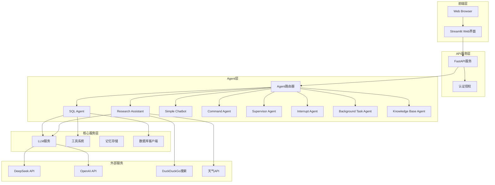

# 🏗️ 系统架构设计文档

## 🎯 概述

Agent Service Toolkit是一个基于LangGraph + FastAPI + Streamlit的现代化AI Agent服务框架，提供多种专业化Agent和统一的服务接口。

## 🏗️ 整体架构

### 系统架构图



## 🔄 核心组件

### 1. 前端层 (Frontend Layer)
- **Streamlit应用**: 提供直观的Web界面
- **聊天界面**: 支持实时对话和流式响应
- **结果可视化**: 智能格式化SQL查询结果和数据表格

### 2. API服务层 (API Service Layer)
- **FastAPI服务**: 高性能异步API框架
- **RESTful接口**: 标准化的Agent调用接口
- **WebSocket支持**: 实时流式响应
- **认证授权**: 用户身份验证和权限控制

### 3. Agent层 (Agent Layer)
- **Agent路由器**: 智能路由，根据请求分发到对应Agent
- **多种Agent类型**: 8种专业化Agent，支持不同场景需求
- **统一接口**: 所有Agent遵循相同的调用接口
- **并行执行**: 支持多Agent协作和并行处理

### 4. 核心服务层 (Core Services)
- **LLM抽象层**: 统一的模型接口，支持多种LLM
- **工具系统**: 可扩展的工具注册和执行框架
- **记忆存储**: 多层次记忆架构，支持会话和长期记忆
- **数据库客户端**: 安全的数据库访问和查询执行

## 🤖 Agent工作流程模式

### 1. 简单工作流程
```python
@entrypoint()
async def simple_agent(inputs, *, previous, config):
    """直接LLM调用，适用于基础对话"""
    messages = inputs["messages"]
    if previous:
        messages = previous["messages"] + messages
    
    model = get_model(config["configurable"].get("model"))
    response = await model.ainvoke(messages)
    
    return entrypoint.final(
        value={"messages": [response]}, 
        save={"messages": messages + [response]}
    )
```

### 2. 工具集成工作流程
```python
# 使用LangGraph的标准ReAct模式
class AgentState(MessagesState, total=False):
    safety: LlamaGuardOutput
    remaining_steps: RemainingSteps

# 集成外部工具
tools = [web_search, calculator, weather_api]
model_with_tools = model.bind_tools(tools)
```

### 3. 多阶段复杂工作流程
```python
# 多阶段处理：规划 → 执行 → 反思
workflow = StateGraph(AgentState)
workflow.add_node("planning", planning_phase)
workflow.add_node("execution", tool_execution)
workflow.add_node("reflection", reflection_phase)
workflow.add_conditional_edges("planning", should_use_tools)
```

### 4. 多Agent协调工作流程
```python
# 使用Supervisor模式协调多个专业Agent
workflow = create_supervisor(
    [specialist_agent_1, specialist_agent_2],
    model=model,
    prompt="Coordinate tasks between specialist agents..."
)
```

## 🔧 技术栈

### 后端技术栈
- **FastAPI**: 高性能异步API框架
- **LangGraph**: 状态图工作流引擎 (v0.3+)
- **LangChain**: LLM抽象和工具集成
- **SQLite/PostgreSQL**: 数据存储
- **Pydantic**: 数据验证和序列化

### 前端技术栈
- **Streamlit**: 快速Web应用开发框架
- **Pandas**: 数据处理和表格显示
- **JSON**: 数据交换格式

### LLM集成
- **DeepSeek API**: 主要推理模型
- **OpenAI API**: 备用模型支持
- **Function Calling**: 工具调用机制

## 📁 项目结构

```
agent-service-toolkit/
├── src/                        # 源代码目录
│   ├── agents/                 # Agent实现
│   ├── core/                   # 核心服务
│   ├── service/                # API服务
│   ├── client/                 # 客户端SDK
│   ├── memory/                 # 存储系统
│   ├── schema/                 # 数据模型
│   └── streamlit_app.py        # 前端应用
├── docs/                       # 文档目录
├── requirements.txt            # 依赖配置
└── README.md                  # 项目说明
```

## 🚀 部署架构

### 本地开发部署

```bash
# 1. 克隆项目
git clone https://github.com/your-org/agent-service-toolkit.git
cd agent-service-toolkit

# 2. 安装依赖
pip install -r requirements.txt

# 3. 配置环境变量
cp .env.example .env
# 编辑 .env 文件，添加API密钥

# 4. 启动服务
python src/run_service.py

# 5. 启动前端 (新终端)
streamlit run src/streamlit_app.py
```

### 生产环境部署

#### 环境变量配置
```bash
# 必需的环境变量
DEEPSEEK_API_KEY=your_deepseek_api_key
DEEPSEEK_BASE_URL=https://api.deepseek.com

# 可选的环境变量
OPENAI_API_KEY=your_openai_api_key
OPENWEATHERMAP_API_KEY=your_weather_api_key

# 服务配置
HOST=0.0.0.0
PORT=8080
```

#### 反向代理配置 (Nginx)
```nginx
server {
    listen 80;
    server_name your-domain.com;
    
    location / {
        proxy_pass http://localhost:8501;
        proxy_set_header Host $host;
        proxy_set_header X-Real-IP $remote_addr;
    }
    
    location /api/ {
        proxy_pass http://localhost:8080/;
        proxy_set_header Host $host;
        proxy_set_header X-Real-IP $remote_addr;
    }
}
```

## 🧪 测试和质量保证

### 测试架构

- **单元测试**: Agent功能、工具执行、API接口测试
- **集成测试**: 端到端工作流程、多Agent协作测试
- **验证脚本**: SQL Agent功能验证、API健康检查

### 质量保证措施

1. **代码规范**: 遵循PEP 8 Python编码规范
2. **类型安全**: 完整的Pydantic类型注解和验证
3. **文档覆盖**: 详细的代码注释和API文档
4. **错误处理**: 全面的异常处理和错误恢复
5. **日志记录**: 结构化日志和调试信息
6. **安全检查**: SQL注入防护和输入验证

## 🎯 项目总结

### 技术优势

1. **现代化架构**: 采用LangGraph + FastAPI + Streamlit的现代技术栈
2. **多Agent支持**: 支持多种类型的专业化Agent并行运行
3. **灵活工作流程**: 根据Agent复杂度选择合适的工作流程模式
4. **标准化接口**: 统一的Agent接口和API设计
5. **企业级特性**: 完整的认证、监控、日志体系

### 架构优势

- **微服务设计**: 前端、后端、Agent逻辑完全解耦
- **水平扩展**: 支持多实例部署和负载均衡
- **插件化架构**: 新Agent可通过简单配置快速集成
- **类型安全**: Pydantic确保数据结构的类型安全
- **异步优先**: 全异步架构提供最佳性能

### 适用场景

- **企业AI助手**: 为企业提供多种专业化AI助手服务
- **数据分析平台**: 强大的数据库查询和分析能力
- **研究工具**: 网络搜索和信息收集支持
- **开发框架**: 为AI Agent开发提供标准化框架和最佳实践

---

*本文档持续更新，反映系统架构的最新状态和设计决策。*
