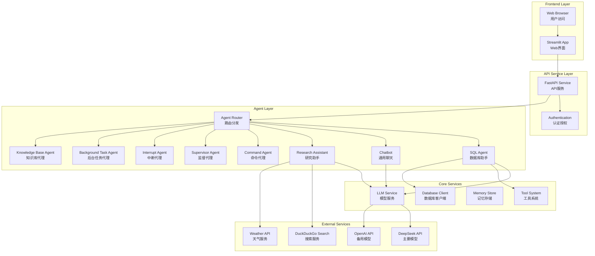
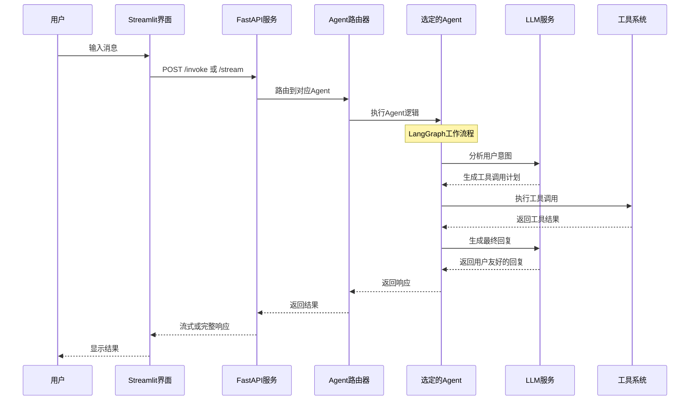
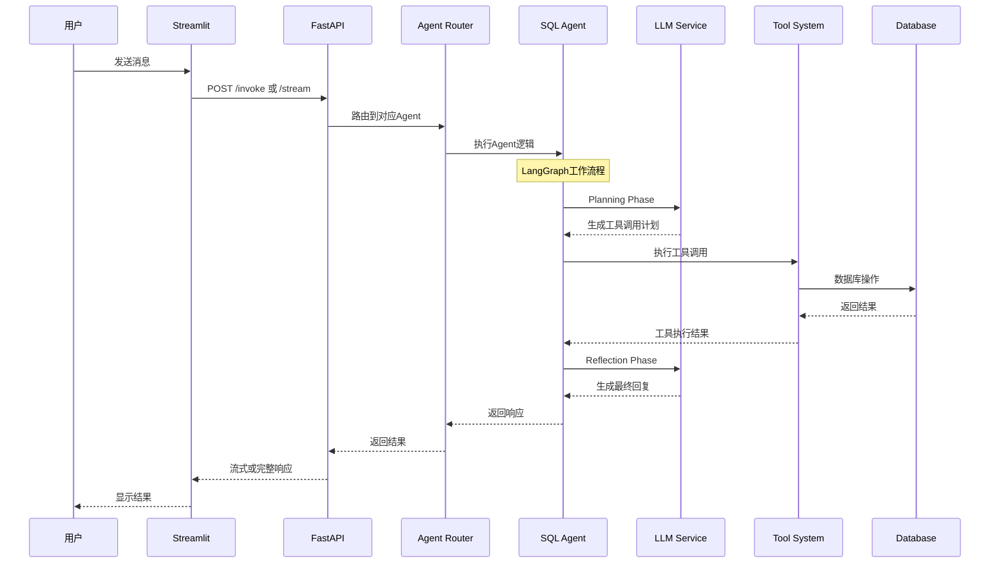
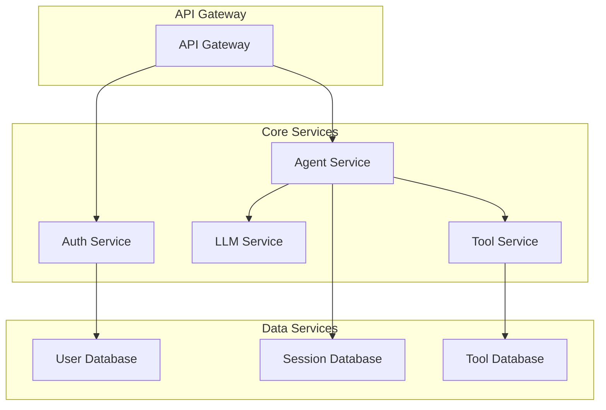

# 🏗️ Agent Service Toolkit - 系统架构文档

## 🎯 项目概述

Agent Service Toolkit 是一个基于现代微服务架构的多Agent智能服务平台。项目采用 **LangGraph + FastAPI + Streamlit** 的技术栈，提供完整的AI Agent开发、部署和交互解决方案。

### 核心特性
- 🤖 **多Agent支持** - 支持多种类型的AI Agent并行运行
- 🔧 **LangGraph框架** - 基于最新LangGraph v0.3特性构建
- ⚡ **高性能服务** - FastAPI提供高性能API服务
- 🎨 **友好界面** - Streamlit提供直观的Web交互界面
- 📊 **流式响应** - 支持token级和message级流式响应
- 🔒 **企业级特性** - 包含认证、监控、日志等企业级功能

## 🧠 核心设计理念

### 1. 微服务架构
- **服务分离**: 前端、后端、Agent逻辑完全解耦
- **水平扩展**: 支持多实例部署和负载均衡
- **独立部署**: 各组件可独立更新和维护

### 2. Agent抽象化
- **统一接口**: 所有Agent遵循相同的调用接口
- **插件化设计**: 新Agent可通过简单配置快速集成
- **状态管理**: 统一的会话状态和内存管理

### 3. 现代化技术栈
- **异步优先**: 全异步架构提供最佳性能
- **类型安全**: Pydantic确保数据结构的类型安全
- **标准化**: 遵循OpenAPI、WebSocket等行业标准

## 🔧 系统架构

### 整体架构图



### 核心组件说明

#### 1. Frontend Layer (前端层)
- **Streamlit App**: 提供Web界面，支持实时聊天和流式响应
- **Web Browser**: 用户通过浏览器访问应用

#### 2. API Gateway Layer (API网关层)
- **FastAPI Service**: 高性能API服务，提供RESTful接口
- **Authentication**: JWT认证和用户管理
- **Rate Limiting**: API调用频率限制和流量控制

#### 3. Agent Layer (Agent层)
- **Agent Router**: 智能路由，根据请求分发到对应Agent
- **SQL Agent**: 数据库查询和分析助手
- **Research Assistant**: 网络搜索和研究助手
- **Simple Chatbot**: 基础对话机器人
- **Command Agent**: 命令执行代理
- **Interrupt Agent**: 支持中断的交互代理
- **Background Task Agent**: 后台任务处理代理
- **Knowledge Base Agent**: 知识库检索代理
- **Supervisor Agent**: 多Agent协调监督代理

#### 4. Core Services (核心服务层)
- **LLM Service**: 统一的模型调用服务
- **Tool Registry**: 工具注册和管理中心
- **Memory Store**: 会话记忆和长期存储
- **Database**: 数据持久化存储

## 🔄 实际使用示例

### 典型用户交互流程



### 示例场景：SQL Agent数据库查询

**用户输入**:
```
分析一下用户表中各部门的薪资分布情况，并给出优化建议
```

**系统处理流程**:

1. **用户交互**: 用户在Streamlit界面输入查询
2. **API调用**: Streamlit调用FastAPI的/sql-agent/invoke端点
3. **Agent路由**: 系统路由到SQL Agent
4. **LangGraph工作流程**:
   - **Planning Phase**: 分析用户意图，选择合适的工具
   - **Tool Execution**: 执行`get_database_schema`、`execute_sql_query`等工具
   - **Reflection Phase**: 分析结果并生成智能回复
5. **结果返回**: 通过API返回到Streamlit界面展示

### 技术栈详解

#### 后端技术栈
- **FastAPI**: 高性能异步API框架
- **LangGraph**: 状态图工作流引擎 (v0.3+)
- **LangChain**: LLM抽象和工具集成
- **SQLite**: 轻量级数据库存储
- **Pydantic**: 数据验证和序列化

#### 前端技术栈
- **Streamlit**: 快速Web应用开发框架
- **Pandas**: 数据处理和表格显示
- **JSON**: 数据交换格式

#### LLM集成
- **DeepSeek API**: 主要推理模型
- **OpenAI API**: 备用模型支持
- **Function Calling**: 工具调用机制

## 📁 项目结构

```
agent-service-toolkit/
├── src/                        # 源代码目录
│   ├── agents/                 # Agent实现
│   │   ├── __init__.py         # Agent模块导出
│   │   ├── agents.py           # Agent注册和管理
│   │   ├── sql_agent.py        # SQL Agent (数据库助手)
│   │   ├── chatbot.py          # 简单聊天机器人
│   │   ├── research_assistant.py # 研究助手
│   │   ├── command_agent.py    # 命令代理
│   │   ├── interrupt_agent.py  # 中断代理
│   │   ├── bg_task_agent/      # 后台任务代理
│   │   ├── knowledge_base_agent.py # 知识库代理
│   │   ├── langgraph_supervisor_agent.py # 监督代理
│   │   ├── llama_guard.py      # 安全检查
│   │   ├── tools.py            # 通用工具
│   │   └── utils.py            # 工具函数
│   ├── core/                   # 核心服务
│   │   ├── __init__.py         # 核心模块导出
│   │   ├── settings.py         # 配置管理
│   │   ├── llm.py              # LLM模型抽象
│   │   ├── database.py         # 数据库客户端
│   │   └── deepseek_client.py  # DeepSeek API客户端
│   ├── service/                # API服务
│   │   ├── __init__.py         # 服务模块导出
│   │   ├── service.py          # FastAPI应用
│   │   └── utils.py            # 服务工具函数
│   ├── client/                 # 客户端SDK
│   │   ├── __init__.py         # 客户端模块导出
│   │   └── client.py           # Agent客户端
│   ├── memory/                 # 存储系统
│   │   ├── __init__.py         # 存储模块导出
│   │   ├── sqlite.py           # SQLite存储实现
│   │   ├── postgres.py         # PostgreSQL存储实现
│   │   └── mongodb.py          # MongoDB存储实现
│   ├── schema/                 # 数据模型
│   │   ├── __init__.py         # Schema模块导出
│   │   ├── models.py           # 数据模型定义
│   │   ├── schema.py           # API Schema
│   │   └── task_data.py        # 任务数据模型
│   ├── streamlit_app.py        # Streamlit前端应用
│   ├── run_service.py          # 服务启动脚本
│   ├── run_agent.py            # Agent测试脚本
│   └── run_client.py           # 客户端测试脚本
├── docs/                       # 文档目录
│   ├── 01_ARCHITECTURE.md      # 系统架构文档
│   ├── 02_SQL_AGENT_DEVELOPMENT_BACKLOG.md # 开发记录
│   ├── 03_BACKEND_DESIGN.md    # 后端设计文档
│   ├── 04_FRONTEND_DESIGN.md   # 前端设计文档
│   ├── 05_AGENT_MECHANISMS.md  # Agent机制文档
│   ├── 06_LLM_INTEGRATION.md   # LLM集成文档
│   └── 07_DATABASE_STORAGE.md  # 数据库存储文档
├── requirements.txt            # Python依赖配置
├── .env.example               # 环境变量示例
├── verify_sql_agent.py        # SQL Agent验证脚本
└── README.md                  # 项目说明文档
```

### 模块职责说明

#### Agent层 (src/agents/)
- **agents.py**: Agent注册中心，管理所有可用的Agent
- **sql_agent.py**: SQL数据库助手，支持数据库查询和分析
- **research_assistant.py**: 研究助手，集成网络搜索和计算器
- **chatbot.py**: 简单聊天机器人
- **其他Agent**: 命令代理、中断代理、监督代理等专业化Agent

#### 核心服务层 (src/core/)
- **settings.py**: 统一配置管理，支持环境变量和默认值
- **llm.py**: LLM模型抽象层，支持多种模型
- **database.py**: 数据库客户端，提供安全的SQL执行
- **deepseek_client.py**: DeepSeek API的自定义实现

#### API服务层 (src/service/)
- **service.py**: FastAPI应用，提供RESTful API和WebSocket支持
- **utils.py**: 服务层工具函数和中间件

#### 存储层 (src/memory/)
- **sqlite.py**: SQLite会话存储和长期记忆实现
- **postgres.py**: PostgreSQL生产环境存储实现
- **mongodb.py**: MongoDB NoSQL存储实现

## 🔄 核心工作流程

### Agent执行流程



### Agent工作流程模式

项目支持多种Agent工作流程模式，根据Agent类型和复杂度选择合适的实现：

#### 1. 复杂工作流程 (SQL Agent)
SQL Agent采用4阶段LangGraph工作流程：

```python
# Planning Phase (规划阶段)
async def planning_phase(state: SQLAgentState, config: RunnableConfig) -> SQLAgentState:
```
- **意图分析**: 使用LLM分析用户输入
- **工具选择**: 根据意图选择合适的数据库工具
- **参数准备**: 准备SQL查询和分析参数
- **Function Calling**: 生成标准化的工具调用

```python
# Tool Execution (工具执行阶段)
async def tool_node(state: SQLAgentState) -> SQLAgentState:
```
- **工具路由**: 执行数据库查询、分析等工具
- **安全执行**: 在受控环境中执行SQL查询
- **结果收集**: 收集查询结果和元数据

```python
# Reflection Phase (反思阶段)
async def reflection_phase(state: SQLAgentState, config: RunnableConfig) -> SQLAgentState:
```
- **结果分析**: 分析SQL查询结果
- **回复生成**: 生成包含数据洞察的回复
- **上下文更新**: 更新数据库上下文

#### 2. 简化工作流程 (Simple Chatbot)
```python
@entrypoint()
async def chatbot(inputs: dict, *, previous: dict, config: RunnableConfig):
    """简单的对话式Agent，直接调用LLM"""
    messages = inputs["messages"]
    if previous:
        messages = previous["messages"] + messages

    model = get_model(config["configurable"].get("model"))
    response = await model.ainvoke(messages)

    return entrypoint.final(
        value={"messages": [response]},
        save={"messages": messages + [response]}
    )
```

#### 3. 工具集成工作流程 (Research Assistant)
```python
# 使用LangGraph的标准ReAct模式
class AgentState(MessagesState, total=False):
    safety: LlamaGuardOutput
    remaining_steps: RemainingSteps

# 集成多种工具：网络搜索、计算器、天气查询
tools = [DuckDuckGoSearchResults(), calculator, OpenWeatherMapQueryRun()]
```

#### 4. 监督工作流程 (Supervisor Agent)
```python
# 使用LangGraph的create_supervisor创建多Agent协调
workflow = create_supervisor(
    [research_agent, math_agent],
    model=model,
    prompt="You are a team supervisor managing multiple expert agents..."
)
```

## 🛠️ 技术栈详解

### 后端技术栈

#### 1. FastAPI Framework
- **版本**: FastAPI 0.100+
- **特性**:
  - 高性能异步API框架
  - 自动API文档生成 (OpenAPI/Swagger)
  - 类型提示和数据验证
  - WebSocket支持
- **用途**: API网关、路由分发、认证授权

#### 2. LangGraph Framework
- **版本**: LangGraph 0.3+
- **特性**:
  - 状态图工作流引擎
  - 人机交互中断支持
  - 长期记忆存储
  - 流式响应支持
- **用途**: Agent逻辑编排、工作流管理

#### 3. LangChain Ecosystem
- **组件**:
  - `langchain-core`: 核心抽象和接口
  - `langchain-community`: 社区工具和集成
  - `langchain-openai`: OpenAI模型集成
- **用途**: LLM抽象、工具集成、消息处理

### 前端技术栈

#### 1. Streamlit Framework
- **版本**: Streamlit 1.30+
- **特性**:
  - 快速Web应用开发
  - 实时数据更新
  - 丰富的UI组件
  - 会话状态管理
- **用途**: 用户界面、实时聊天、数据可视化

### 数据存储技术

#### 1. SQLite (主要数据库)
- **用途**: SQL Agent的示例数据库
- **特性**: 轻量级、无服务器、事务支持

#### 2. Memory Store (记忆存储)
- **支持类型**:
  - SQLite: 开发和测试环境
  - PostgreSQL: 生产环境
  - MongoDB: NoSQL场景
- **用途**: 会话记忆、长期知识存储

### LLM模型集成

#### 1. DeepSeek API (主要模型)
- **模型**: deepseek-chat
- **特性**: 高性能、成本效益、中文优化
- **用途**: 主要的推理和对话模型

#### 2. OpenAI API (备用模型)
- **模型**: GPT-4o, GPT-4o-mini
- **特性**: 高质量、稳定性好
- **用途**: 备用模型、特殊场景

#### 3. Fake Model (测试模型)
- **用途**: 开发测试、CI/CD环境
- **特性**: 无API调用、可预测响应

## 🚀 部署架构

### 本地开发部署

#### 1. 环境准备
```bash
# 克隆项目
git clone https://github.com/your-org/agent-service-toolkit.git
cd agent-service-toolkit

# 安装依赖
pip install -r requirements.txt

# 配置环境变量
cp .env.example .env
# 编辑 .env 文件，添加必要的API密钥
```

#### 2. 启动服务
```bash
# 启动FastAPI后端服务
python src/run_service.py

# 启动Streamlit前端 (新终端)
streamlit run src/streamlit_app.py
```

#### 3. 访问应用
- **Streamlit界面**: http://localhost:8501
- **FastAPI文档**: http://localhost:8080/docs
- **健康检查**: http://localhost:8080/health

### 生产环境部署

#### 1. 环境变量配置
```bash
# 必需的环境变量
DEEPSEEK_API_KEY=your_deepseek_api_key
DEEPSEEK_BASE_URL=https://api.deepseek.com

# 可选的环境变量
OPENAI_API_KEY=your_openai_api_key
OPENWEATHERMAP_API_KEY=your_weather_api_key

# 服务配置
HOST=0.0.0.0
PORT=8080
```

#### 2. 进程管理
```bash
# 使用systemd管理服务
sudo systemctl start agent-service
sudo systemctl enable agent-service

# 或使用PM2管理
pm2 start src/run_service.py --name agent-service
pm2 start "streamlit run src/streamlit_app.py" --name streamlit-app
```

#### 3. 反向代理配置 (Nginx)
```nginx
server {
    listen 80;
    server_name your-domain.com;

    location / {
        proxy_pass http://localhost:8501;
        proxy_set_header Host $host;
        proxy_set_header X-Real-IP $remote_addr;
    }

    location /api/ {
        proxy_pass http://localhost:8080/;
        proxy_set_header Host $host;
        proxy_set_header X-Real-IP $remote_addr;
    }
}
```

## 🔒 安全设计

### 认证与授权

#### 1. API认证
- **Bearer Token**: JWT令牌认证
- **API Key**: 服务间调用认证
- **Rate Limiting**: 防止API滥用

#### 2. 数据安全
- **SQL注入防护**: 参数化查询、SQL验证
- **输入验证**: Pydantic数据验证
- **输出过滤**: 敏感信息过滤

### 隐私保护

#### 1. 数据处理
- **匿名化**: 用户数据匿名化处理
- **加密存储**: 敏感数据加密存储
- **访问控制**: 基于角色的访问控制

#### 2. 日志安全
- **脱敏日志**: 自动脱敏敏感信息
- **审计跟踪**: 完整的操作审计日志
- **合规性**: 符合GDPR、CCPA等法规

## 📊 监控与可观测性

### 应用监控

#### 1. 性能指标
- **响应时间**: API响应时间监控
- **吞吐量**: 请求处理能力监控
- **错误率**: 错误和异常监控
- **资源使用**: CPU、内存、磁盘使用率

#### 2. 业务指标
- **Agent使用率**: 各Agent的使用频率
- **工具调用统计**: 工具使用情况分析
- **用户行为**: 用户交互模式分析
- **模型性能**: LLM调用成功率和延迟

### 日志管理

#### 1. 结构化日志
```python
logger.info("Agent execution", extra={
    "agent_type": "sql-agent",
    "user_id": "user123",
    "thread_id": "thread456",
    "execution_time": 1.23,
    "tools_used": ["get_database_schema", "execute_sql_query"]
})
```

#### 2. 日志聚合
- **ELK Stack**: Elasticsearch + Logstash + Kibana
- **Fluentd**: 日志收集和转发
- **Grafana**: 日志可视化和告警

## 🔄 扩展性设计

### 水平扩展

#### 1. 无状态设计
- **API服务**: 完全无状态，支持任意扩展
- **会话存储**: 外部化到Redis/数据库
- **负载均衡**: 支持多实例负载均衡

#### 2. 微服务拆分


### 垂直扩展

#### 1. 性能优化
- **连接池**: 数据库连接池优化
- **缓存策略**: Redis缓存热点数据
- **异步处理**: 全异步架构提升并发

#### 2. 资源优化
- **内存管理**: 优化内存使用和垃圾回收
- **CPU优化**: 多核并行处理
- **I/O优化**: 异步I/O和批处理

## 🎯 项目总结

### 技术优势

1. **现代化架构**: 采用最新的微服务和异步技术
2. **高可扩展性**: 支持水平和垂直扩展
3. **企业级特性**: 完整的监控、安全、日志体系
4. **开发友好**: 类型安全、自动文档、测试覆盖

### 业务价值

1. **快速开发**: 标准化的Agent开发框架
2. **灵活部署**: 支持多种部署模式
3. **高可用性**: 分布式架构保证服务稳定
4. **成本效益**: 优化的资源使用和模型调用

### 未来发展

1. **多模态支持**: 图像、语音等多模态输入
2. **边缘计算**: 支持边缘设备部署
3. **联邦学习**: 分布式模型训练和优化
4. **自动化运维**: AI驱动的运维和优化

---

*本文档持续更新，反映系统架构的最新状态和设计决策。*

#### Phase 3: Reflection (反思整合阶段)
```python
def _reflection_phase(self, user_input: str, execution_results: List) -> Dict[str, Any]:
```
1. **结果整合**: 汇总所有工具执行结果
2. **智能分析**: 使用 LLM 分析结果的业务价值
3. **回复生成**: 生成有价值、易理解的最终回复
4. **状态更新**: 更新对话历史和执行状态

#### Phase 4: State Management (状态管理)
```python
self.conversation_state = {
    "messages": [],      # 对话消息历史
    "tool_calls": [],    # 工具调用历史
    "execution_history": []  # 执行结果历史
}
```

## 🛠️ 工具系统详解

### 工具架构设计

项目采用模块化的工具设计，每个工具都是独立的类，实现标准化的接口。工具通过 Function Calling 机制被 Agent 调用。

### 核心工具详解

#### 1. SQLTool (SQL 执行工具)
```python
class SQLTool:
    @staticmethod
    def get_schema() -> str
    @staticmethod
    def execute_sql(sql: str) -> Dict[str, Any]
    @staticmethod
    def list_all_tables() -> List[str]
    @staticmethod
    def get_table_structure(table_name: str) -> List
    @staticmethod
    def get_database_stats() -> Dict[str, Any]
```

**功能特性**:
- 数据库模式查询和表结构分析
- SQL 语句执行 (SELECT, INSERT, UPDATE, DELETE, DDL)
- 事务支持和错误处理
- 数据库统计信息收集

#### 2. DataAnalysisTool (数据分析工具)
```python
class DataAnalysisTool:
    def __init__(self, api_key: str, base_url: str)
    def analyze_data(self, query_result: Dict, context: str) -> str
    def analyze_schema(self, schema_info: str) -> str
```

**功能特性**:
- 基于 LLM 的智能数据分析
- 查询结果的业务洞察生成
- 数据库设计评估和优化建议
- 支持自定义分析上下文

### Function Calling 工具定义

#### 1. get_database_schema
- **功能**: 获取完整的数据库结构信息
- **参数**: 无
- **返回**: 包含所有表结构的详细信息
- **使用场景**: 用户询问数据库结构、表信息

#### 2. generate_and_execute_sql
- **功能**: 根据用户需求生成并执行 SQL 语句
- **参数**:
  - `user_request` (string): 用户的具体需求描述
  - `sql_query` (string): 要执行的 SQL 语句
- **返回**: SQL 执行结果和状态信息
- **使用场景**: 数据查询、修改、DDL 操作

#### 3. analyze_query_results
- **功能**: 分析查询结果并提供业务洞察
- **参数**:
  - `query_result` (object): 查询结果数据
  - `context` (string): 查询的业务上下文
- **返回**: 智能分析报告和建议
- **使用场景**: 需要数据分析和业务建议

#### 4. analyze_database_schema
- **功能**: 分析数据库模式并提供优化建议
- **参数**:
  - `schema_info` (string): 数据库模式信息
- **返回**: 设计评估和优化建议
- **使用场景**: 数据库设计评估、性能优化

## 🎯 实际使用示例

### 文件监控触发机制

用户通过编辑 `prompt.txt` 文件来触发 Agent 处理：

```bash
# 启动监控
python main.py

# 编辑 prompt.txt 文件
echo "数据库里有什么表？" > prompt.txt
```

### 典型使用场景

#### 场景 1: 数据库结构查询
```
用户输入: "数据库里有什么表？"
Agent 工作流程:
  Phase 1 (Planning): 分析意图 → 选择 get_database_schema
  Phase 2 (Execution): 调用 SQLTool.get_schema()
  Phase 3 (Reflection): 整合结果 → 生成友好回复
结果: 返回完整的数据库结构信息和表统计
```

#### 场景 2: 数据查询操作
```
用户输入: "查询所有用户信息"
Agent 工作流程:
  Phase 1 (Planning): 分析需求 → 选择 generate_and_execute_sql
  Phase 2 (Execution): 生成 SQL → 执行查询
  Phase 3 (Reflection): 格式化结果 → 生成报告
结果: 执行 SELECT 查询并返回格式化的数据
```

#### 场景 3: 复合智能分析
```
用户输入: "分析用户年龄分布并给出业务建议"
Agent 工作流程:
  Phase 1 (Planning): 复杂意图分析 → 选择多工具组合
  Phase 2 (Execution):
    1. generate_and_execute_sql (查询年龄数据)
    2. analyze_query_results (智能分析)
  Phase 3 (Reflection): 整合分析结果 → 生成业务洞察
结果: 数据查询 + 统计分析 + 业务建议
```

#### 场景 4: 数据库设计评估
```
用户输入: "评估当前数据库设计是否合理"
Agent 工作流程:
  Phase 1 (Planning): 设计评估需求 → 选择模式分析工具
  Phase 2 (Execution):
    1. get_database_schema (获取完整模式)
    2. analyze_database_schema (设计分析)
  Phase 3 (Reflection): 生成设计评估报告
结果: 数据库设计分析 + 优化建议 + 最佳实践
```

## 🚀 技术实现特点

### 1. 智能决策能力
- **LLM 驱动**: 使用 DeepSeek Chat API 进行智能决策
- **上下文感知**: 基于对话历史和数据库状态进行决策
- **动态适应**: 根据执行结果调整后续策略
- **意图理解**: 深度理解用户的真实需求

### 2. 标准化架构
- **Function Calling**: 严格遵循 OpenAI Function Calling 标准
- **结构化接口**: 统一的工具定义和参数传递格式
- **错误处理**: 标准化的错误处理和状态返回机制
- **API 兼容**: 支持多种 LLM API 提供商

### 3. 高可扩展性
- **模块化设计**: 核心、工具、监控模块完全解耦
- **插件架构**: 新工具可以无缝集成到现有系统
- **配置驱动**: 通过环境变量和配置文件管理系统行为
- **接口标准**: 统一的工具接口便于扩展

### 4. 生产级可靠性
- **事务支持**: 数据库操作支持事务和回滚
- **错误恢复**: 完整的异常处理和错误恢复机制
- **状态管理**: 完整的对话状态和执行历史记录
- **监控日志**: 详细的执行日志和性能监控

### 5. 开发友好
- **类型提示**: 完整的 Python 类型注解
- **文档完善**: 详细的代码注释和架构文档
- **测试覆盖**: 完整的单元测试和集成测试
- **示例丰富**: 多种使用场景的示例代码

## � 核心组件详解

### AgenticSQLAgent (核心智能代理)

```python
class AgenticSQLAgent:
    def __init__(self, api_key: str, base_url: str)
    def process_request(self, user_input: str) -> Dict[str, Any]
    def _planning_phase(self, user_input: str) -> Dict[str, Any]
    def _execute_tool(self, tool_call: Dict) -> Dict[str, Any]
    def _reflection_phase(self, user_input: str, results: List) -> Dict[str, Any]
```

**核心职责**:
- 四阶段工作流程的协调和执行
- LLM API 调用和响应处理
- 工具路由和执行管理
- 对话状态和历史管理

### DatabaseClient (数据库客户端)

```python
class DatabaseClient:
    def __init__(self, db_path: str = "data/database.db")
    def execute_sql(self, sql: str) -> Dict[str, Any]
    def get_schema_info(self) -> str
    def list_tables(self) -> List[str]
    def describe_table(self, table_name: str) -> List[Tuple]
```

**核心特性**:
- SQLite 连接管理和事务支持
- SQL 执行和结果格式化
- 数据库模式查询和分析
- 错误处理和连接池管理

### Agent Router (Agent路由器)

```python
def get_agent(agent_id: str) -> Pregel:
    """根据ID获取Agent实例"""
    return agents[agent_id].graph

def get_all_agent_info() -> list[AgentInfo]:
    """获取所有Agent信息"""
    return [AgentInfo(key=agent_id, description=agent.description)
            for agent_id, agent in agents.items()]
```

**路由机制**:
- 基于Agent ID的动态路由
- 支持多种Agent类型并行运行
- 统一的Agent接口和生命周期管理
- 灵活的Agent注册和发现机制

## 🧪 测试和质量保证

### 测试架构

项目包含完整的测试套件，确保系统的可靠性和稳定性：

#### 单元测试
- **Agent功能测试**: 验证各Agent的核心工作流程
- **工具执行测试**: 验证工具调用和结果处理
- **API接口测试**: 验证FastAPI端点的正确性
- **数据库操作测试**: 验证SQL执行和安全性

#### 集成测试
- **端到端测试**: 完整的用户交互流程测试
- **多Agent协作测试**: 验证Agent间的协调工作
- **流式响应测试**: 验证实时响应功能
- **错误恢复测试**: 验证异常情况的处理能力

#### 验证脚本
- **verify_sql_agent.py**: SQL Agent功能验证
- **API健康检查**: 服务状态和可用性检查
- **性能基准测试**: 响应时间和资源使用监控

### 质量保证措施

1. **代码规范**: 遵循PEP 8 Python编码规范
2. **类型安全**: 完整的Pydantic类型注解和验证
3. **文档覆盖**: 详细的代码注释和API文档
4. **错误处理**: 全面的异常处理和错误恢复
5. **日志记录**: 结构化日志和调试信息
6. **安全检查**: SQL注入防护和输入验证

## 🎯 项目总结

### 技术优势

1. **现代化架构**: 采用LangGraph + FastAPI + Streamlit的现代技术栈
2. **多Agent支持**: 支持多种类型的专业化Agent并行运行
3. **灵活工作流程**: 根据Agent复杂度选择合适的工作流程模式
4. **标准化接口**: 统一的Agent接口和API设计
5. **企业级特性**: 完整的认证、监控、日志体系

### 架构优势

- **微服务设计**: 前端、后端、Agent逻辑完全解耦
- **水平扩展**: 支持多实例部署和负载均衡
- **插件化架构**: 新Agent可通过简单配置快速集成
- **类型安全**: Pydantic确保数据结构的类型安全
- **异步优先**: 全异步架构提供最佳性能

### 适用场景

- **企业AI助手**: 为企业提供多种专业化AI助手服务
- **数据分析平台**: SQL Agent提供强大的数据库查询和分析能力
- **研究工具**: Research Assistant支持网络搜索和信息收集
- **开发框架**: 为AI Agent开发提供标准化框架和最佳实践

### 快速开始

```bash
# 1. 克隆项目
git clone https://github.com/your-org/agent-service-toolkit.git
cd agent-service-toolkit

# 2. 安装依赖
pip install -r requirements.txt

# 3. 配置环境变量
cp .env.example .env
# 编辑 .env 文件，添加API密钥

# 4. 启动服务
python src/run_service.py

# 5. 启动前端 (新终端)
streamlit run src/streamlit_app.py

# 6. 访问应用
# Streamlit界面: http://localhost:8501
# API文档: http://localhost:8080/docs
```

### 未来发展

1. **多模态支持**: 图像、语音等多模态输入
2. **边缘计算**: 支持边缘设备部署
3. **联邦学习**: 分布式模型训练和优化
4. **自动化运维**: AI驱动的运维和优化

---

*本文档持续更新，反映系统架构的最新状态和设计决策。*

