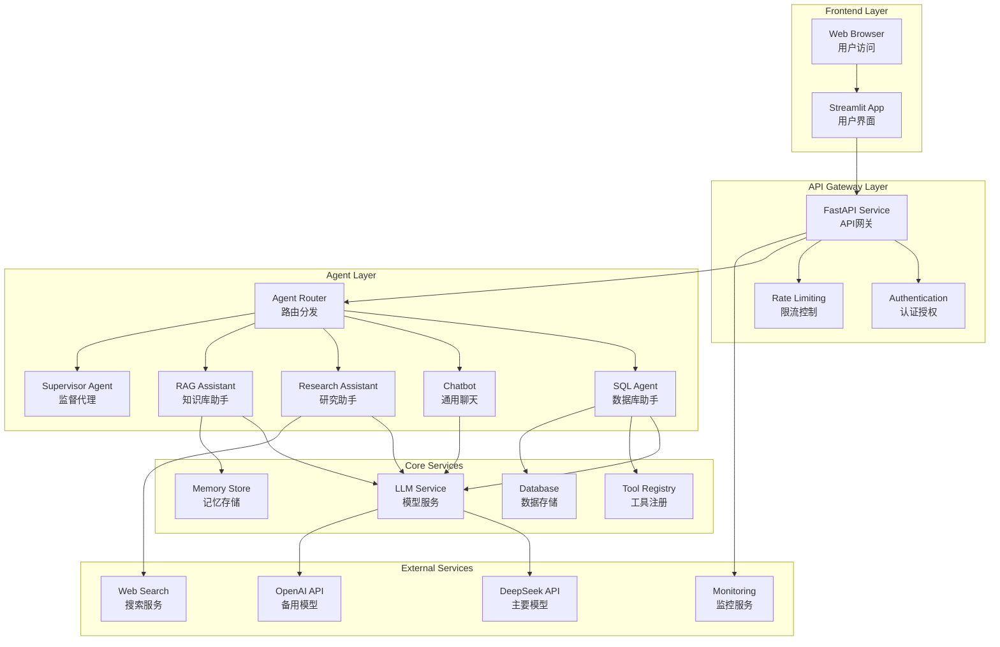
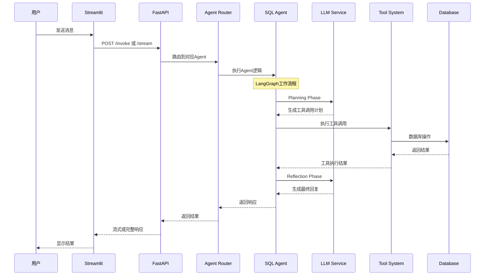
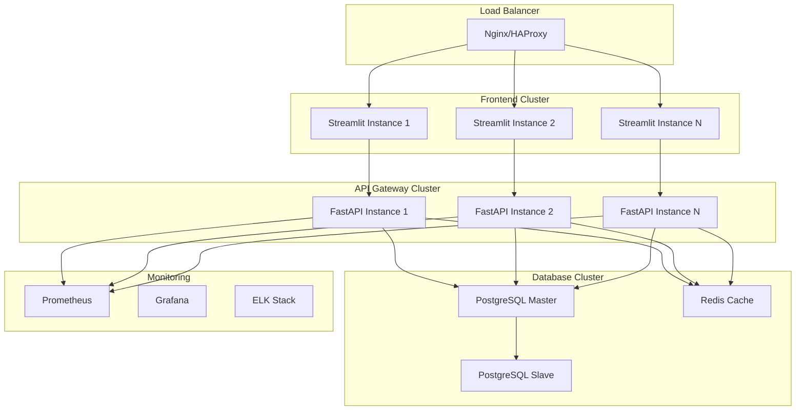
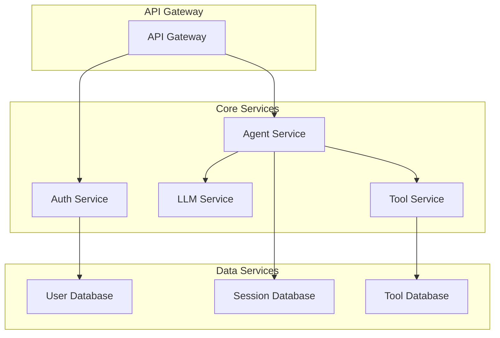

# 🏗️ Agent Service Toolkit - 系统架构文档

## 🎯 项目概述

Agent Service Toolkit 是一个基于现代微服务架构的多Agent智能服务平台。项目采用 **LangGraph + FastAPI + Streamlit** 的技术栈，提供完整的AI Agent开发、部署和交互解决方案。

### 核心特性
- 🤖 **多Agent支持** - 支持多种类型的AI Agent并行运行
- 🔧 **LangGraph框架** - 基于最新LangGraph v0.3特性构建
- ⚡ **高性能服务** - FastAPI提供高性能API服务
- 🎨 **友好界面** - Streamlit提供直观的Web交互界面
- 📊 **流式响应** - 支持token级和message级流式响应
- 🔒 **企业级特性** - 包含认证、监控、日志等企业级功能

## 🧠 核心设计理念

### 1. 微服务架构
- **服务分离**: 前端、后端、Agent逻辑完全解耦
- **水平扩展**: 支持多实例部署和负载均衡
- **独立部署**: 各组件可独立更新和维护

### 2. Agent抽象化
- **统一接口**: 所有Agent遵循相同的调用接口
- **插件化设计**: 新Agent可通过简单配置快速集成
- **状态管理**: 统一的会话状态和内存管理

### 3. 现代化技术栈
- **异步优先**: 全异步架构提供最佳性能
- **类型安全**: Pydantic确保数据结构的类型安全
- **标准化**: 遵循OpenAPI、WebSocket等行业标准

## 🔧 系统架构

### 整体架构图



### 核心组件说明

#### 1. Frontend Layer (前端层)
- **Streamlit App**: 提供Web界面，支持实时聊天和流式响应
- **Web Browser**: 用户通过浏览器访问应用

#### 2. API Gateway Layer (API网关层)
- **FastAPI Service**: 高性能API服务，提供RESTful接口
- **Authentication**: JWT认证和用户管理
- **Rate Limiting**: API调用频率限制和流量控制

#### 3. Agent Layer (Agent层)
- **Agent Router**: 智能路由，根据请求分发到对应Agent
- **Multiple Agents**: 支持多种专业化Agent并行运行

#### 4. Core Services (核心服务层)
- **LLM Service**: 统一的模型调用服务
- **Tool Registry**: 工具注册和管理中心
- **Memory Store**: 会话记忆和长期存储
- **Database**: 数据持久化存储

```
┌─────────────────────────────────────────────────────────────┐
│                    用户输入 (prompt.txt)                      │
│                   文件变化触发机制                            │
└─────────────────────┬───────────────────────────────────────┘
                      │
┌─────────────────────▼───────────────────────────────────────┐
│              AgenticDatabaseMonitor                         │
│                (文件监控器)                                   │
│  ┌─────────────────────────────────────────────────────────┐ │
│  │         AgenticPromptHandler                            │ │
│  │           (事件处理器)                                   │ │
│  └─────────────────────────────────────────────────────────┘ │
└─────────────────────┬───────────────────────────────────────┘
                      │
┌─────────────────────▼───────────────────────────────────────┐
│                AgenticSQLAgent                              │
│                (核心智能代理)                                 │
│                                                             │
│  ┌─────────────┐  ┌─────────────┐  ┌─────────────┐         │
│  │  Planning   │→ │ Tool Select │→ │ Execution   │         │
│  │    阶段     │  │    阶段     │  │    阶段     │         │
│  │ LLM分析意图  │  │ 选择工具组合 │  │ 执行工具调用 │         │
│  └─────────────┘  └─────────────┘  └─────────────┘         │
│                                           │                 │
│  ┌─────────────┐                         │                 │
│  │ Reflection  │←────────────────────────┘                 │
│  │    阶段     │                                           │
│  │ 整合结果回复 │                                           │
│  └─────────────┘                                           │
└─────────────────────┬───────────────────────────────────────┘
                      │
┌─────────────────────▼───────────────────────────────────────┐
│                    工具层                                    │
│                                                             │
│  ┌─────────────┐  ┌─────────────┐  ┌─────────────┐         │
│  │   SQLTool   │  │DataAnalysis │  │ 未来扩展... │         │
│  │             │  │    Tool     │  │             │         │
│  │ 数据库操作   │  │ 智能分析     │  │             │         │
│  └─────────────┘  └─────────────┘  └─────────────┘         │
└─────────────────────┬───────────────────────────────────────┘
                      │
┌─────────────────────▼───────────────────────────────────────┐
│                DatabaseClient                               │
│                (SQLite 数据库)                               │
│  ┌─────────────────────────────────────────────────────────┐ │
│  │ • 连接管理 • 事务支持 • 错误处理 • 模式查询              │ │
│  └─────────────────────────────────────────────────────────┘ │
└─────────────────────────────────────────────────────────────┘
```

### 技术栈

- **编程语言**: Python 3.7+
- **AI 模型**: DeepSeek Chat API (支持 Function Calling)
- **数据库**: SQLite 3
- **文件监控**: Watchdog
- **HTTP 客户端**: Requests
- **环境管理**: python-dotenv

## 📁 项目结构

```
PDME-PoC/
├── src/                        # 源代码目录
│   ├── __init__.py             # 包初始化
│   ├── core/                   # 核心模块
│   │   ├── __init__.py         # 核心模块导出
│   │   ├── agentic_agent.py    # AgenticSQLAgent 核心智能代理
│   │   └── database.py         # DatabaseClient 数据库客户端
│   ├── tools/                  # 工具模块
│   │   ├── __init__.py         # 工具模块导出
│   │   ├── sql_tool.py         # SQLTool SQL执行工具
│   │   └── analysis_tool.py    # DataAnalysisTool 数据分析工具
│   └── monitor/                # 监控模块
│       ├── __init__.py         # 监控模块导出
│       └── file_monitor.py     # AgenticDatabaseMonitor 文件监控器
├── tests/                      # 测试目录
│   ├── __init__.py             # 测试包初始化
│   └── test_agentic_agent.py   # Agent 功能测试
├── examples/                   # 示例和演示
│   └── basic_demo.py           # 基础功能演示脚本
├── docs/                       # 文档目录
│   └── ARCHITECTURE.md         # 架构文档 (本文档)
├── data/                       # 数据文件目录
│   └── database.db             # SQLite 数据库文件
├── main.py                     # 主入口文件
├── prompt.txt                  # 用户输入文件 (监控目标)
├── requirements.txt            # Python 依赖配置
└── README.md                   # 项目说明文档
```

### 模块职责说明

#### 核心模块 (src/core/)
- **agentic_agent.py**: 实现 `AgenticSQLAgent` 类，负责四阶段工作流程
- **database.py**: 实现 `DatabaseClient` 类，提供数据库操作接口

#### 工具模块 (src/tools/)
- **sql_tool.py**: 实现 `SQLTool` 类，封装数据库操作功能
- **analysis_tool.py**: 实现 `DataAnalysisTool` 类，提供智能数据分析

#### 监控模块 (src/monitor/)
- **file_monitor.py**: 实现文件监控和事件处理逻辑

## 🔄 核心工作流程

### Agent执行流程



### LangGraph Agent工作流程

#### 1. Planning Phase (规划阶段)
```python
async def planning_phase(state: SQLAgentState, config: RunnableConfig) -> SQLAgentState:
```
- **意图分析**: 使用LLM分析用户输入
- **工具选择**: 根据意图选择合适的工具
- **参数准备**: 准备工具调用参数
- **Function Calling**: 生成标准化的工具调用

#### 2. Tool Execution (工具执行阶段)
```python
async def tool_node(state: SQLAgentState) -> SQLAgentState:
```
- **工具路由**: 根据工具名称分发到具体工具
- **安全执行**: 在受控环境中执行工具
- **结果收集**: 收集执行结果和元数据
- **错误处理**: 统一的错误处理和恢复机制

#### 3. Reflection Phase (反思阶段)
```python
async def reflection_phase(state: SQLAgentState, config: RunnableConfig) -> SQLAgentState:
```
- **结果分析**: 分析工具执行结果
- **回复生成**: 基于结果生成用户友好的回复
- **上下文更新**: 更新会话上下文和状态

## 🛠️ 技术栈详解

### 后端技术栈

#### 1. FastAPI Framework
- **版本**: FastAPI 0.100+
- **特性**:
  - 高性能异步API框架
  - 自动API文档生成 (OpenAPI/Swagger)
  - 类型提示和数据验证
  - WebSocket支持
- **用途**: API网关、路由分发、认证授权

#### 2. LangGraph Framework
- **版本**: LangGraph 0.3+
- **特性**:
  - 状态图工作流引擎
  - 人机交互中断支持
  - 长期记忆存储
  - 流式响应支持
- **用途**: Agent逻辑编排、工作流管理

#### 3. LangChain Ecosystem
- **组件**:
  - `langchain-core`: 核心抽象和接口
  - `langchain-community`: 社区工具和集成
  - `langchain-openai`: OpenAI模型集成
- **用途**: LLM抽象、工具集成、消息处理

### 前端技术栈

#### 1. Streamlit Framework
- **版本**: Streamlit 1.30+
- **特性**:
  - 快速Web应用开发
  - 实时数据更新
  - 丰富的UI组件
  - 会话状态管理
- **用途**: 用户界面、实时聊天、数据可视化

### 数据存储技术

#### 1. SQLite (主要数据库)
- **用途**: SQL Agent的示例数据库
- **特性**: 轻量级、无服务器、事务支持

#### 2. Memory Store (记忆存储)
- **支持类型**:
  - SQLite: 开发和测试环境
  - PostgreSQL: 生产环境
  - MongoDB: NoSQL场景
- **用途**: 会话记忆、长期知识存储

### LLM模型集成

#### 1. DeepSeek API (主要模型)
- **模型**: deepseek-chat
- **特性**: 高性能、成本效益、中文优化
- **用途**: 主要的推理和对话模型

#### 2. OpenAI API (备用模型)
- **模型**: GPT-4o, GPT-4o-mini
- **特性**: 高质量、稳定性好
- **用途**: 备用模型、特殊场景

#### 3. Fake Model (测试模型)
- **用途**: 开发测试、CI/CD环境
- **特性**: 无API调用、可预测响应

## 🚀 部署架构

### 部署模式

#### 1. 单机部署 (开发/测试)
```yaml
# docker-compose.yml
version: '3.8'
services:
  agent-service:
    build: .
    ports:
      - "8080:8080"
    environment:
      - DEEPSEEK_API_KEY=${DEEPSEEK_API_KEY}
    volumes:
      - ./data:/app/data

  streamlit-app:
    build: .
    command: streamlit run src/streamlit_app.py
    ports:
      - "8501:8501"
    depends_on:
      - agent-service
```

#### 2. 微服务部署 (生产环境)


### 容器化部署

#### 1. Dockerfile
```dockerfile
FROM python:3.11-slim

WORKDIR /app
COPY requirements.txt .
RUN pip install -r requirements.txt

COPY src/ ./src/
COPY docs/ ./docs/

EXPOSE 8080
CMD ["python", "src/run_service.py"]
```

#### 2. Kubernetes部署
```yaml
apiVersion: apps/v1
kind: Deployment
metadata:
  name: agent-service
spec:
  replicas: 3
  selector:
    matchLabels:
      app: agent-service
  template:
    metadata:
      labels:
        app: agent-service
    spec:
      containers:
      - name: agent-service
        image: agent-service:latest
        ports:
        - containerPort: 8080
        env:
        - name: DEEPSEEK_API_KEY
          valueFrom:
            secretKeyRef:
              name: api-secrets
              key: deepseek-key
```

## 🔒 安全设计

### 认证与授权

#### 1. API认证
- **Bearer Token**: JWT令牌认证
- **API Key**: 服务间调用认证
- **Rate Limiting**: 防止API滥用

#### 2. 数据安全
- **SQL注入防护**: 参数化查询、SQL验证
- **输入验证**: Pydantic数据验证
- **输出过滤**: 敏感信息过滤

### 隐私保护

#### 1. 数据处理
- **匿名化**: 用户数据匿名化处理
- **加密存储**: 敏感数据加密存储
- **访问控制**: 基于角色的访问控制

#### 2. 日志安全
- **脱敏日志**: 自动脱敏敏感信息
- **审计跟踪**: 完整的操作审计日志
- **合规性**: 符合GDPR、CCPA等法规

## 📊 监控与可观测性

### 应用监控

#### 1. 性能指标
- **响应时间**: API响应时间监控
- **吞吐量**: 请求处理能力监控
- **错误率**: 错误和异常监控
- **资源使用**: CPU、内存、磁盘使用率

#### 2. 业务指标
- **Agent使用率**: 各Agent的使用频率
- **工具调用统计**: 工具使用情况分析
- **用户行为**: 用户交互模式分析
- **模型性能**: LLM调用成功率和延迟

### 日志管理

#### 1. 结构化日志
```python
logger.info("Agent execution", extra={
    "agent_type": "sql-agent",
    "user_id": "user123",
    "thread_id": "thread456",
    "execution_time": 1.23,
    "tools_used": ["get_database_schema", "execute_sql_query"]
})
```

#### 2. 日志聚合
- **ELK Stack**: Elasticsearch + Logstash + Kibana
- **Fluentd**: 日志收集和转发
- **Grafana**: 日志可视化和告警

## 🔄 扩展性设计

### 水平扩展

#### 1. 无状态设计
- **API服务**: 完全无状态，支持任意扩展
- **会话存储**: 外部化到Redis/数据库
- **负载均衡**: 支持多实例负载均衡

#### 2. 微服务拆分


### 垂直扩展

#### 1. 性能优化
- **连接池**: 数据库连接池优化
- **缓存策略**: Redis缓存热点数据
- **异步处理**: 全异步架构提升并发

#### 2. 资源优化
- **内存管理**: 优化内存使用和垃圾回收
- **CPU优化**: 多核并行处理
- **I/O优化**: 异步I/O和批处理

## 🎯 项目总结

### 技术优势

1. **现代化架构**: 采用最新的微服务和异步技术
2. **高可扩展性**: 支持水平和垂直扩展
3. **企业级特性**: 完整的监控、安全、日志体系
4. **开发友好**: 类型安全、自动文档、测试覆盖

### 业务价值

1. **快速开发**: 标准化的Agent开发框架
2. **灵活部署**: 支持多种部署模式
3. **高可用性**: 分布式架构保证服务稳定
4. **成本效益**: 优化的资源使用和模型调用

### 未来发展

1. **多模态支持**: 图像、语音等多模态输入
2. **边缘计算**: 支持边缘设备部署
3. **联邦学习**: 分布式模型训练和优化
4. **自动化运维**: AI驱动的运维和优化

---

*本文档持续更新，反映系统架构的最新状态和设计决策。*

#### Phase 3: Reflection (反思整合阶段)
```python
def _reflection_phase(self, user_input: str, execution_results: List) -> Dict[str, Any]:
```
1. **结果整合**: 汇总所有工具执行结果
2. **智能分析**: 使用 LLM 分析结果的业务价值
3. **回复生成**: 生成有价值、易理解的最终回复
4. **状态更新**: 更新对话历史和执行状态

#### Phase 4: State Management (状态管理)
```python
self.conversation_state = {
    "messages": [],      # 对话消息历史
    "tool_calls": [],    # 工具调用历史
    "execution_history": []  # 执行结果历史
}
```

## 🛠️ 工具系统详解

### 工具架构设计

项目采用模块化的工具设计，每个工具都是独立的类，实现标准化的接口。工具通过 Function Calling 机制被 Agent 调用。

### 核心工具详解

#### 1. SQLTool (SQL 执行工具)
```python
class SQLTool:
    @staticmethod
    def get_schema() -> str
    @staticmethod
    def execute_sql(sql: str) -> Dict[str, Any]
    @staticmethod
    def list_all_tables() -> List[str]
    @staticmethod
    def get_table_structure(table_name: str) -> List
    @staticmethod
    def get_database_stats() -> Dict[str, Any]
```

**功能特性**:
- 数据库模式查询和表结构分析
- SQL 语句执行 (SELECT, INSERT, UPDATE, DELETE, DDL)
- 事务支持和错误处理
- 数据库统计信息收集

#### 2. DataAnalysisTool (数据分析工具)
```python
class DataAnalysisTool:
    def __init__(self, api_key: str, base_url: str)
    def analyze_data(self, query_result: Dict, context: str) -> str
    def analyze_schema(self, schema_info: str) -> str
```

**功能特性**:
- 基于 LLM 的智能数据分析
- 查询结果的业务洞察生成
- 数据库设计评估和优化建议
- 支持自定义分析上下文

### Function Calling 工具定义

#### 1. get_database_schema
- **功能**: 获取完整的数据库结构信息
- **参数**: 无
- **返回**: 包含所有表结构的详细信息
- **使用场景**: 用户询问数据库结构、表信息

#### 2. generate_and_execute_sql
- **功能**: 根据用户需求生成并执行 SQL 语句
- **参数**:
  - `user_request` (string): 用户的具体需求描述
  - `sql_query` (string): 要执行的 SQL 语句
- **返回**: SQL 执行结果和状态信息
- **使用场景**: 数据查询、修改、DDL 操作

#### 3. analyze_query_results
- **功能**: 分析查询结果并提供业务洞察
- **参数**:
  - `query_result` (object): 查询结果数据
  - `context` (string): 查询的业务上下文
- **返回**: 智能分析报告和建议
- **使用场景**: 需要数据分析和业务建议

#### 4. analyze_database_schema
- **功能**: 分析数据库模式并提供优化建议
- **参数**:
  - `schema_info` (string): 数据库模式信息
- **返回**: 设计评估和优化建议
- **使用场景**: 数据库设计评估、性能优化

## 🎯 实际使用示例

### 文件监控触发机制

用户通过编辑 `prompt.txt` 文件来触发 Agent 处理：

```bash
# 启动监控
python main.py

# 编辑 prompt.txt 文件
echo "数据库里有什么表？" > prompt.txt
```

### 典型使用场景

#### 场景 1: 数据库结构查询
```
用户输入: "数据库里有什么表？"
Agent 工作流程:
  Phase 1 (Planning): 分析意图 → 选择 get_database_schema
  Phase 2 (Execution): 调用 SQLTool.get_schema()
  Phase 3 (Reflection): 整合结果 → 生成友好回复
结果: 返回完整的数据库结构信息和表统计
```

#### 场景 2: 数据查询操作
```
用户输入: "查询所有用户信息"
Agent 工作流程:
  Phase 1 (Planning): 分析需求 → 选择 generate_and_execute_sql
  Phase 2 (Execution): 生成 SQL → 执行查询
  Phase 3 (Reflection): 格式化结果 → 生成报告
结果: 执行 SELECT 查询并返回格式化的数据
```

#### 场景 3: 复合智能分析
```
用户输入: "分析用户年龄分布并给出业务建议"
Agent 工作流程:
  Phase 1 (Planning): 复杂意图分析 → 选择多工具组合
  Phase 2 (Execution):
    1. generate_and_execute_sql (查询年龄数据)
    2. analyze_query_results (智能分析)
  Phase 3 (Reflection): 整合分析结果 → 生成业务洞察
结果: 数据查询 + 统计分析 + 业务建议
```

#### 场景 4: 数据库设计评估
```
用户输入: "评估当前数据库设计是否合理"
Agent 工作流程:
  Phase 1 (Planning): 设计评估需求 → 选择模式分析工具
  Phase 2 (Execution):
    1. get_database_schema (获取完整模式)
    2. analyze_database_schema (设计分析)
  Phase 3 (Reflection): 生成设计评估报告
结果: 数据库设计分析 + 优化建议 + 最佳实践
```

## 🚀 技术实现特点

### 1. 智能决策能力
- **LLM 驱动**: 使用 DeepSeek Chat API 进行智能决策
- **上下文感知**: 基于对话历史和数据库状态进行决策
- **动态适应**: 根据执行结果调整后续策略
- **意图理解**: 深度理解用户的真实需求

### 2. 标准化架构
- **Function Calling**: 严格遵循 OpenAI Function Calling 标准
- **结构化接口**: 统一的工具定义和参数传递格式
- **错误处理**: 标准化的错误处理和状态返回机制
- **API 兼容**: 支持多种 LLM API 提供商

### 3. 高可扩展性
- **模块化设计**: 核心、工具、监控模块完全解耦
- **插件架构**: 新工具可以无缝集成到现有系统
- **配置驱动**: 通过环境变量和配置文件管理系统行为
- **接口标准**: 统一的工具接口便于扩展

### 4. 生产级可靠性
- **事务支持**: 数据库操作支持事务和回滚
- **错误恢复**: 完整的异常处理和错误恢复机制
- **状态管理**: 完整的对话状态和执行历史记录
- **监控日志**: 详细的执行日志和性能监控

### 5. 开发友好
- **类型提示**: 完整的 Python 类型注解
- **文档完善**: 详细的代码注释和架构文档
- **测试覆盖**: 完整的单元测试和集成测试
- **示例丰富**: 多种使用场景的示例代码

## � 核心组件详解

### AgenticSQLAgent (核心智能代理)

```python
class AgenticSQLAgent:
    def __init__(self, api_key: str, base_url: str)
    def process_request(self, user_input: str) -> Dict[str, Any]
    def _planning_phase(self, user_input: str) -> Dict[str, Any]
    def _execute_tool(self, tool_call: Dict) -> Dict[str, Any]
    def _reflection_phase(self, user_input: str, results: List) -> Dict[str, Any]
```

**核心职责**:
- 四阶段工作流程的协调和执行
- LLM API 调用和响应处理
- 工具路由和执行管理
- 对话状态和历史管理

### DatabaseClient (数据库客户端)

```python
class DatabaseClient:
    def __init__(self, db_path: str = "data/database.db")
    def execute_sql(self, sql: str) -> Dict[str, Any]
    def get_schema_info(self) -> str
    def list_tables(self) -> List[str]
    def describe_table(self, table_name: str) -> List[Tuple]
```

**核心特性**:
- SQLite 连接管理和事务支持
- SQL 执行和结果格式化
- 数据库模式查询和分析
- 错误处理和连接池管理

### AgenticDatabaseMonitor (文件监控器)

```python
class AgenticDatabaseMonitor:
    def start(self)
    def stop(self)

class AgenticPromptHandler(FileSystemEventHandler):
    def on_modified(self, event)
    def _process_agentic_prompt(self)
```

**监控机制**:
- 基于 Watchdog 的文件系统监控
- 实时检测 prompt.txt 文件变化
- 自动触发 Agent 处理流程
- 支持热重载和状态恢复

## 🧪 测试和质量保证

### 测试架构

项目包含完整的测试套件，确保系统的可靠性和稳定性：

#### 单元测试 (tests/test_agentic_agent.py)
- **基本功能测试**: 验证 Agent 的核心工作流程
- **工具选择测试**: 验证智能工具选择的准确性
- **错误处理测试**: 验证异常情况的处理能力
- **状态管理测试**: 验证对话状态的正确维护

#### 集成测试 (examples/basic_demo.py)
- **端到端测试**: 完整的用户交互流程测试
- **多场景验证**: 不同使用场景的综合测试
- **性能基准**: 响应时间和资源使用监控

### 质量保证措施

1. **代码规范**: 遵循 PEP 8 Python 编码规范
2. **类型检查**: 完整的类型注解和静态检查
3. **文档覆盖**: 详细的代码注释和 API 文档
4. **错误处理**: 全面的异常处理和错误恢复
5. **日志记录**: 详细的执行日志和调试信息

## �🔮 扩展方向和路线图

### 短期扩展 (1-3 个月)

#### 1. 工具生态扩展
- **数据可视化工具**: 集成 matplotlib/plotly 生成图表
- **导出工具**: 支持 CSV、Excel、JSON 等格式导出
- **备份恢复工具**: 数据库备份和恢复功能

#### 2. 用户体验优化
- **Web 界面**: 基于 FastAPI + React 的 Web 界面
- **实时通知**: WebSocket 实时状态推送
- **历史管理**: 查询历史和结果缓存

### 中期扩展 (3-6 个月)

#### 3. 多数据库支持
- **MySQL/PostgreSQL**: 扩展到主流关系型数据库
- **NoSQL 支持**: MongoDB、Redis 等 NoSQL 数据库
- **云数据库**: AWS RDS、Azure SQL 等云数据库

#### 4. 高级分析功能
- **机器学习集成**: 集成 scikit-learn 进行数据挖掘
- **统计分析**: 高级统计分析和预测功能
- **报告生成**: 自动生成分析报告和仪表板

### 长期扩展 (6+ 个月)

#### 5. 企业级功能
- **权限管理**: 基于角色的访问控制 (RBAC)
- **多租户支持**: 支持多组织和用户隔离
- **审计日志**: 完整的操作审计和合规支持

#### 6. 智能化升级
- **自学习能力**: 基于使用历史优化工具选择
- **预测分析**: 基于历史数据进行趋势预测
- **自动优化**: 数据库性能自动优化建议

## 🎯 项目总结

### 技术创新点

1. **Agentic 架构**: 采用四阶段智能工作流程，实现真正的智能决策
2. **Function Calling**: 严格遵循行业标准，确保工具调用的一致性和可靠性
3. **动态工具选择**: Agent 根据用户意图自主选择工具，避免硬编码流程
4. **上下文感知**: 基于对话历史和数据库状态进行智能决策

### 架构优势

- **高度模块化**: 核心、工具、监控模块完全解耦，易于维护和扩展
- **标准化接口**: 统一的工具接口和错误处理机制
- **生产就绪**: 完整的错误处理、事务支持和监控日志
- **开发友好**: 完善的文档、测试和示例代码

### 适用场景

- **数据分析师**: 快速进行数据查询和分析
- **开发人员**: 数据库操作和模式设计验证
- **业务人员**: 通过自然语言进行数据查询
- **学习研究**: Agentic 架构和 Function Calling 的实践案例

### 部署和使用

```bash
# 1. 环境准备
git clone <repository-url>
cd PDME-PoC
pip install -r requirements.txt

# 2. 配置环境变量
export DEEPSEEK_API_KEY="your_api_key"
export DEEPSEEK_BASE_URL="https://api.deepseek.com"

# 3. 启动系统
python main.py

# 4. 开始使用
echo "数据库里有什么表？" > prompt.txt
```

---

**PDME-PoC** 展示了现代 Agentic 架构在数据库操作领域的强大潜力，为智能数据助手的发展提供了坚实的技术基础和实践参考。
