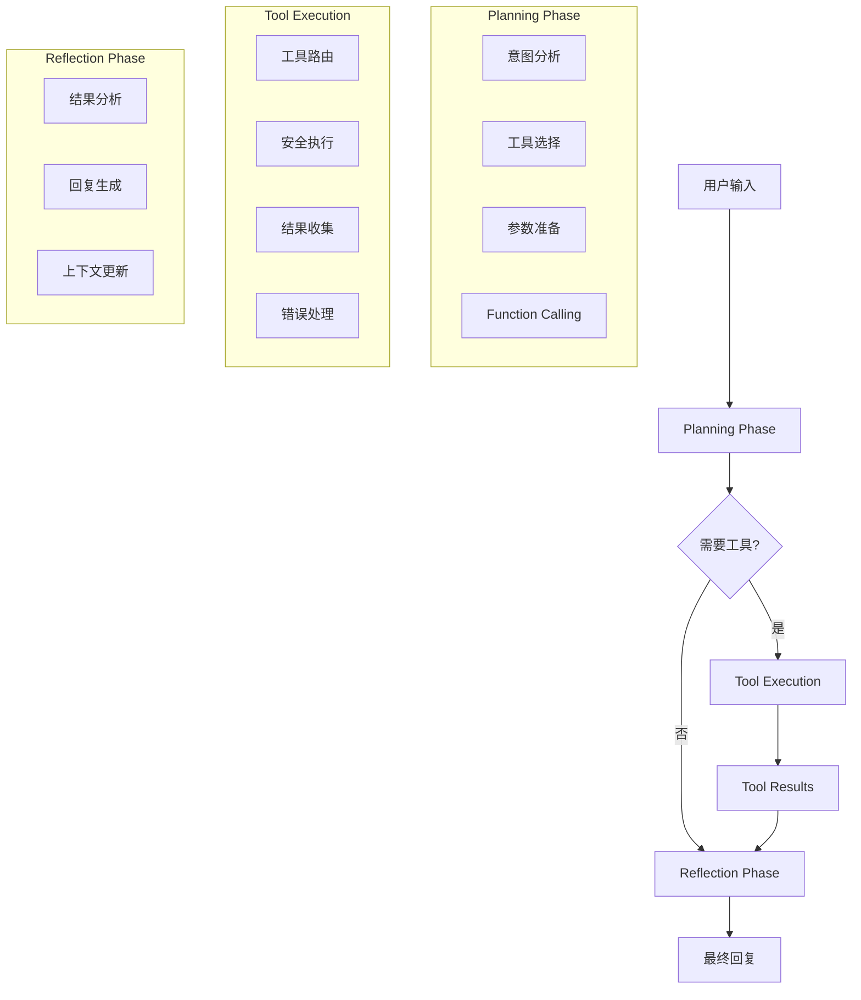

# 🤖 Agent机制详细设计文档

## 🎯 概述

本文档详细描述Agent Service Toolkit中各种Agent的实现机制，包括LangGraph工作流设计、状态管理、工具集成等核心技术。

## 🏗️ LangGraph框架基础

### 状态图架构

```python
from langgraph.graph import StateGraph, END
from langgraph.managed import RemainingSteps

class AgentState(MessagesState, total=False):
    """Agent状态定义"""
    safety: LlamaGuardOutput          # 安全检查结果
    remaining_steps: RemainingSteps   # 剩余执行步数
    planning_result: dict             # 规划阶段结果
    database_context: dict            # 数据库上下文
```

### 基础工作流模式

```python
# 创建状态图
agent = StateGraph(AgentState)

# 添加节点
agent.add_node("guard_input", llama_guard_input)      # 输入安全检查
agent.add_node("model", acall_model)                  # 模型调用
agent.add_node("tools", ToolNode(tools))              # 工具执行
agent.add_node("block_unsafe_content", block_unsafe)  # 阻止不安全内容

# 设置入口点
agent.set_entry_point("guard_input")

# 添加条件边
agent.add_conditional_edges(
    "guard_input", 
    check_safety, 
    {"unsafe": "block_unsafe_content", "safe": "model"}
)

agent.add_conditional_edges(
    "model",
    should_continue,
    {"continue": "tools", "end": END}
)

agent.add_edge("tools", "model")
agent.add_edge("block_unsafe_content", END)
```

## 🧠 SQL Agent详细设计

### 四阶段工作流程



#### 1. Planning Phase实现
```python
async def planning_phase(state: SQLAgentState, config: RunnableConfig) -> SQLAgentState:
    """规划阶段 - 分析用户意图并选择工具"""
    logger.info("🚀 Starting planning phase")
    messages = state["messages"]
    last_message = messages[-1] if messages else None
    
    if not last_message:
        return {"messages": [AIMessage(content="No user input received.")]}
    
    # 获取数据库上下文
    schema_info = get_database_schema.invoke({})
    
    # 构建规划提示
    planning_prompt = f"""
    You are an intelligent SQL database assistant. You MUST use the available tools to answer user questions.

    Available tools:
    1. get_database_schema - Get database structure information
    2. generate_sql_query - Generate SQL queries from natural language
    3. execute_sql_query - Execute SQL queries safely
    4. analyze_query_results - Analyze query results for insights
    5. analyze_database_schema - Analyze database design and optimization

    Current database schema:
    {schema_info}

    User request: {last_message.content}

    You MUST call the appropriate tools. Do not just provide a text response.
    """
    
    # 获取模型并绑定工具
    model = get_model(config["configurable"].get("model", settings.DEFAULT_MODEL))
    model_with_tools = model.bind_tools(sql_tools)
    
    planning_messages = [
        SystemMessage(content=planning_prompt),
        last_message
    ]
    
    response = await model_with_tools.ainvoke(planning_messages, config)
    
    # 存储规划结果
    planning_result = {
        "planned_tools": response.tool_calls if hasattr(response, 'tool_calls') else [],
        "reasoning": response.content
    }
    
    return {
        "messages": [response],
        "planning_result": planning_result,
        "database_context": schema_info
    }
```

#### 2. Tool Execution实现
```python
# SQL Agent工具集
sql_tools = [
    get_database_schema,
    execute_sql_query,
    analyze_query_results,
    analyze_database_schema,
    generate_sql_query,
]

@tool
def get_database_schema() -> str:
    """获取数据库结构信息"""
    logger.info("🔍 Executing get_database_schema tool")
    
    try:
        db_client = get_database_client()
        schema_info = db_client.get_schema_info()
        
        if 'tables' not in schema_info:
            return f"Error retrieving schema: {schema_info}"
        
        # 格式化schema信息
        formatted_schema = format_schema_for_display(schema_info)
        logger.info("📋 Schema formatted successfully")
        
        return formatted_schema
    except Exception as e:
        logger.error(f"❌ Error in get_database_schema: {e}")
        return f"Error retrieving database schema: {str(e)}"

@tool
def execute_sql_query(query: str) -> str:
    """安全执行SQL查询"""
    logger.info(f"🔍 Executing SQL query: {query[:100]}...")
    
    try:
        db_client = get_database_client()
        result = db_client.execute_query(query)
        
        # 返回JSON格式的结果，便于前端格式化
        return json.dumps(result, ensure_ascii=False, indent=2)
    except Exception as e:
        logger.error(f"❌ Error executing SQL query: {e}")
        return json.dumps({
            "success": False,
            "error": str(e),
            "query": query
        })
```

#### 3. Reflection Phase实现
```python
async def reflection_phase(state: SQLAgentState, config: RunnableConfig) -> SQLAgentState:
    """反思阶段 - 分析结果并生成最终回复"""
    logger.info("🤔 Starting reflection phase")
    
    messages = state["messages"]
    planning_result = state.get("planning_result", {})
    
    # 分析工具执行结果
    tool_results = []
    for msg in messages:
        if hasattr(msg, 'type') and msg.type == 'tool':
            tool_results.append(msg.content)
    
    # 构建反思提示
    reflection_prompt = f"""
    Based on the tool execution results, provide a comprehensive and user-friendly response.
    
    Planning context: {planning_result.get('reasoning', '')}
    Tool results: {tool_results}
    
    Provide insights, explanations, and actionable information based on the results.
    """
    
    model = get_model(config["configurable"].get("model", settings.DEFAULT_MODEL))
    
    reflection_messages = [
        SystemMessage(content=reflection_prompt),
        HumanMessage(content="Please analyze the results and provide a comprehensive response.")
    ]
    
    response = await model.ainvoke(reflection_messages, config)
    
    return {"messages": [response]}
```

### 条件路由逻辑
```python
async def should_use_tools(state: SQLAgentState) -> Literal["tools", "reflection"]:
    """判断是否需要执行工具"""
    logger.info("🤔 Determining whether to use tools or go to reflection")
    
    last_message = state["messages"][-1]
    
    if hasattr(last_message, 'tool_calls') and last_message.tool_calls:
        logger.info("✅ Going to tools node")
        return "tools"
    else:
        logger.info("⚠️ No tool calls found, going to reflection")
        return "reflection"
```

## 🔍 Research Assistant设计

### 工具集成架构
```python
# Research Assistant工具集
tools = [
    DuckDuckGoSearchResults(max_results=5),
    calculator,
    OpenWeatherMapQueryRun(api_wrapper=OpenWeatherMapAPIWrapper())
]

class AgentState(MessagesState, total=False):
    safety: LlamaGuardOutput
    remaining_steps: RemainingSteps

async def acall_model(state: AgentState, config: RunnableConfig) -> AgentState:
    """调用模型并处理安全检查"""
    m = get_model(config["configurable"].get("model", settings.DEFAULT_MODEL))
    model_runnable = wrap_model(m)
    response = await model_runnable.ainvoke(state, config)
    
    # Llama Guard安全检查
    llama_guard = LlamaGuard()
    safety_output = await llama_guard.ainvoke("Agent", state["messages"] + [response])
    
    if safety_output.safety_assessment == SafetyAssessment.UNSAFE:
        return {"messages": [format_safety_message(safety_output)], "safety": safety_output}
    
    # 检查剩余步数
    if state["remaining_steps"] < 2 and response.tool_calls:
        return {
            "messages": [
                AIMessage(
                    id=response.id,
                    content="Sorry, need more steps to process this request.",
                )
            ]
        }
    
    return {"messages": [response]}
```

### 安全检查机制
```python
async def llama_guard_input(state: AgentState, config: RunnableConfig) -> AgentState:
    """输入安全检查"""
    llama_guard = LlamaGuard()
    safety_output = await llama_guard.ainvoke("User", state["messages"])
    return {"safety": safety_output, "messages": []}

def check_safety(state: AgentState) -> Literal["unsafe", "safe"]:
    """检查安全状态"""
    safety: LlamaGuardOutput = state["safety"]
    match safety.safety_assessment:
        case SafetyAssessment.UNSAFE:
            return "unsafe"
        case _:
            return "safe"
```

## 💬 Simple Chatbot设计

### 最简化实现
```python
from langgraph.func import entrypoint

@entrypoint()
async def chatbot(
    inputs: dict[str, list[BaseMessage]],
    *,
    previous: dict[str, list[BaseMessage]],
    config: RunnableConfig,
):
    """简单聊天机器人"""
    messages = inputs["messages"]
    if previous:
        messages = previous["messages"] + messages

    model = get_model(config["configurable"].get("model", settings.DEFAULT_MODEL))
    response = await model.ainvoke(messages)
    
    return entrypoint.final(
        value={"messages": [response]}, 
        save={"messages": messages + [response]}
    )
```

## 🎭 Supervisor Agent设计

### 多Agent协调
```python
from langgraph.prebuilt import create_react_agent, create_supervisor

# 创建专业Agent
math_agent = create_react_agent(
    model=model,
    tools=[add, multiply],
    name="math_expert",
    prompt="You are a math expert. Always use one tool at a time.",
).with_config(tags=["skip_stream"])

research_agent = create_react_agent(
    model=model,
    tools=[web_search],
    name="research_expert",
    prompt="You are a world class researcher with access to web search. Do not do any math.",
).with_config(tags=["skip_stream"])

# 创建监督工作流
workflow = create_supervisor(
    [research_agent, math_agent],
    model=model,
    prompt=(
        "You are a team supervisor managing a research expert and a math expert. "
        "For current events, use research_agent. "
        "For math problems, use math_agent."
    ),
    add_handoff_back_messages=False,
)

langgraph_supervisor_agent = workflow.compile()
```

## 🔧 工具系统设计

### 工具定义标准
```python
from langchain_core.tools import tool

@tool
def calculator(expression: str) -> str:
    """计算数学表达式
    
    Args:
        expression: 要计算的数学表达式，如 "2 + 3 * 4"
    
    Returns:
        计算结果的字符串表示
    """
    try:
        # 安全的数学表达式计算
        allowed_names = {
            k: v for k, v in math.__dict__.items() 
            if not k.startswith("__")
        }
        allowed_names.update({"abs": abs, "round": round})
        
        result = eval(expression, {"__builtins__": {}}, allowed_names)
        return str(result)
    except Exception as e:
        return f"计算错误: {e}"
```

### 工具安全执行
```python
def safe_tool_execution(tool: BaseTool, args: dict) -> str:
    """安全执行工具"""
    try:
        # 参数验证
        if hasattr(tool, 'args_schema') and tool.args_schema:
            validated_args = tool.args_schema(**args)
            result = tool.invoke(validated_args.dict())
        else:
            result = tool.invoke(args)
        
        return str(result)
    except ValidationError as e:
        return f"参数验证失败: {e}"
    except Exception as e:
        logger.error(f"Tool execution error: {e}")
        return f"工具执行失败: {e}"
```

## 📊 状态管理

### 会话状态
```python
class SQLAgentState(MessagesState, total=False):
    """SQL Agent状态定义"""
    # 继承基础消息状态
    messages: list[BaseMessage]
    
    # 扩展状态字段
    safety: LlamaGuardOutput          # 安全检查结果
    remaining_steps: RemainingSteps   # 剩余步数
    planning_result: dict             # 规划结果
    database_context: dict            # 数据库上下文
    tool_results: list[dict]          # 工具执行结果
    user_preferences: dict            # 用户偏好设置
```

### 长期记忆
```python
async def store_user_preference(state: SQLAgentState, config: RunnableConfig):
    """存储用户偏好到长期记忆"""
    store = config.get("store")
    if store:
        user_id = config["configurable"]["user_id"]
        namespace = ("user_preferences", user_id)
        
        preferences = {
            "preferred_query_format": "table",
            "show_query_details": True,
            "last_interaction": datetime.utcnow().isoformat()
        }
        
        await store.aput(namespace, "sql_preferences", preferences)
```

## 🔄 错误处理与恢复

### 异常处理机制
```python
async def handle_agent_error(state: AgentState, error: Exception) -> AgentState:
    """Agent错误处理"""
    logger.error(f"Agent execution error: {error}")
    
    error_message = AIMessage(
        content=f"抱歉，处理您的请求时遇到了问题: {str(error)}。请稍后重试或换个方式提问。"
    )
    
    return {"messages": [error_message]}

# 在Agent中使用错误处理
try:
    result = await agent.ainvoke(input_data, config)
except Exception as e:
    result = await handle_agent_error(state, e)
```

---

*本文档详细描述了各种Agent的实现机制和设计模式，为Agent开发提供技术指导。*
