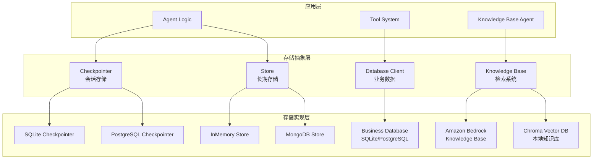
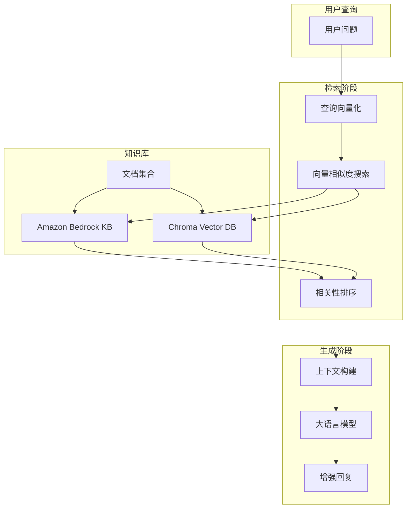
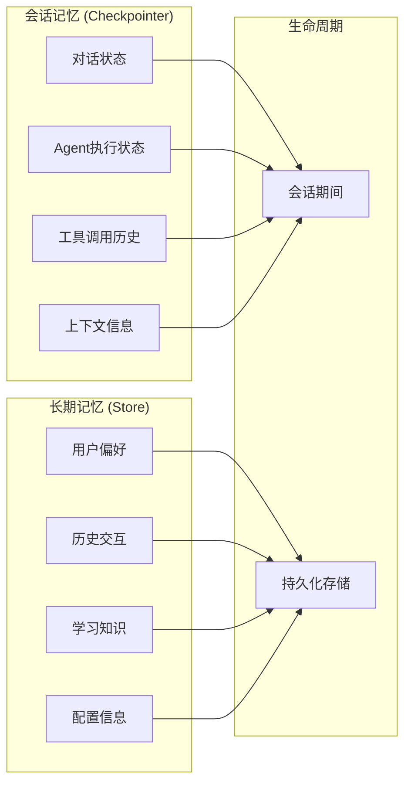

# 💾 数据库与存储详细设计文档

## 🎯 概述

本文档详细描述Agent Service Toolkit中的完整存储架构，包括：

- **SQL Agent数据库集成** - 业务数据的安全查询和管理
- **会话存储系统** - Agent对话状态的短期记忆管理
- **长期记忆存储** - 用户偏好和历史信息的持久化
- **知识库系统** - RAG检索增强生成的外部知识源
- **记忆系统设计** - 多层次记忆架构和性能优化

### 🗂️ 存储系统分类

项目包含四种主要的存储系统：

1. **会话存储 (Checkpointer)** - 短期记忆，存储对话状态和Agent执行状态
2. **长期存储 (Store)** - 长期记忆，存储用户偏好、历史信息等持久化数据
3. **业务数据库 (Database Client)** - SQL Agent使用的业务数据存储
4. **知识库系统 (Knowledge Base)** - RAG检索增强生成的外部知识源

## 🏗️ 存储架构概览

### 多层存储设计



## 🗄️ SQL Agent数据库集成

### 数据库客户端设计

```python
# src/core/database.py
class DatabaseClient:
    """安全的数据库客户端，支持SQLite"""
    
    def __init__(self, db_path: str = "sql_agent.db"):
        self.db_path = db_path
        self.connection_timeout = 30
        self._ensure_database_exists()
        self._create_sample_tables()
    
    @contextmanager
    def _get_connection(self):
        """获取数据库连接，自动处理错误"""
        conn = None
        try:
            conn = sqlite3.connect(
                self.db_path,
                timeout=self.connection_timeout,
                check_same_thread=False
            )
            conn.row_factory = sqlite3.Row  # 支持列名访问
            yield conn
        except sqlite3.Error as e:
            if conn:
                conn.rollback()
            raise DatabaseError(f"Database connection error: {e}")
        finally:
            if conn:
                conn.close()
    
    def get_schema_info(self) -> Dict[str, Any]:
        """获取数据库结构信息"""
        try:
            with self._get_connection() as conn:
                cursor = conn.cursor()
                
                # 获取所有表
                cursor.execute("""
                    SELECT name FROM sqlite_master 
                    WHERE type='table' AND name NOT LIKE 'sqlite_%'
                """)
                tables = [row[0] for row in cursor.fetchall()]
                
                schema_info = {
                    'database_type': 'SQLite',
                    'database_path': self.db_path,
                    'tables': {}
                }
                
                # 获取每个表的详细信息
                for table in tables:
                    cursor.execute(f'PRAGMA table_info({table})')
                    columns = cursor.fetchall()
                    
                    cursor.execute(f'SELECT COUNT(*) FROM {table}')
                    row_count = cursor.fetchone()[0]
                    
                    schema_info['tables'][table] = {
                        'columns': [
                            {
                                'name': col[1],
                                'type': col[2],
                                'not_null': bool(col[3]),
                                'default_value': col[4],
                                'primary_key': bool(col[5])
                            }
                            for col in columns
                        ],
                        'row_count': row_count
                    }
                
                return schema_info
                
        except Exception as e:
            logger.error(f'Failed to get schema info: {e}')
            return {
                'error': str(e),
                'database_type': 'SQLite',
                'database_path': self.db_path
            }
```

### SQL查询安全执行

```python
def execute_query(self, query: str, params: Optional[Tuple] = None) -> Dict[str, Any]:
    """安全执行SQL查询"""
    try:
        # SQL注入防护
        self._validate_sql_query(query)
        
        with self._get_connection() as conn:
            cursor = conn.cursor()
            
            # 使用参数化查询
            if params:
                cursor.execute(query, params)
            else:
                cursor.execute(query)
            
            # 处理不同类型的查询
            if query.upper().strip().startswith(('SELECT', 'WITH')):
                # SELECT查询
                rows = cursor.fetchall()
                columns = [desc[0] for desc in cursor.description] if cursor.description else []
                
                results = []
                for row in rows:
                    results.append(dict(zip(columns, row)))
                
                return {
                    'success': True,
                    'query': query,
                    'results': results,
                    'row_count': len(results),
                    'columns': columns,
                    'query_type': 'SELECT'
                }
            else:
                # INSERT, UPDATE, DELETE查询
                conn.commit()
                return {
                    'success': True,
                    'query': query,
                    'rows_affected': cursor.rowcount,
                    'query_type': 'MODIFY'
                }
                
    except Exception as e:
        return {
            'success': False,
            'error': str(e),
            'error_type': 'DATABASE_ERROR',
            'query': query
        }

def _validate_sql_query(self, query: str):
    """验证SQL查询安全性"""
    query_upper = query.upper().strip()
    
    # 禁止的操作
    forbidden_keywords = [
        'DROP', 'DELETE', 'TRUNCATE', 'ALTER', 'CREATE', 'INSERT', 'UPDATE',
        'PRAGMA', 'ATTACH', 'DETACH'
    ]
    
    for keyword in forbidden_keywords:
        if keyword in query_upper:
            raise SQLValidationError(f"Forbidden SQL keyword: {keyword}")
    
    # 只允许SELECT和WITH查询
    if not query_upper.startswith(('SELECT', 'WITH')):
        raise SQLValidationError("Only SELECT and WITH queries are allowed")
    
    # 检查查询长度
    if len(query) > 1000:
        raise SQLValidationError("Query too long")
```

### 示例数据初始化

```python
def _create_sample_tables(self):
    """创建示例表和数据"""
    sample_tables = [
        '''
        CREATE TABLE IF NOT EXISTS users (
            id INTEGER PRIMARY KEY AUTOINCREMENT,
            name TEXT NOT NULL,
            email TEXT UNIQUE NOT NULL,
            age INTEGER,
            department TEXT,
            salary DECIMAL(10,2),
            created_at TIMESTAMP DEFAULT CURRENT_TIMESTAMP
        )
        ''',
        '''
        CREATE TABLE IF NOT EXISTS orders (
            id INTEGER PRIMARY KEY AUTOINCREMENT,
            user_id INTEGER,
            product_name TEXT NOT NULL,
            amount DECIMAL(10,2) NOT NULL,
            order_date TIMESTAMP DEFAULT CURRENT_TIMESTAMP,
            status TEXT DEFAULT 'pending',
            FOREIGN KEY (user_id) REFERENCES users (id)
        )
        ''',
        '''
        CREATE TABLE IF NOT EXISTS products (
            id INTEGER PRIMARY KEY AUTOINCREMENT,
            name TEXT NOT NULL,
            price DECIMAL(10,2) NOT NULL,
            category TEXT,
            stock_quantity INTEGER DEFAULT 0,
            description TEXT
        )
        '''
    ]
    
    sample_data = [
        "INSERT OR IGNORE INTO users (name, email, age, department, salary) VALUES ('John Doe', 'john@example.com', 30, 'Engineering', 75000)",
        "INSERT OR IGNORE INTO users (name, email, age, department, salary) VALUES ('Jane Smith', 'jane@example.com', 25, 'Marketing', 65000)",
        "INSERT OR IGNORE INTO users (name, email, age, department, salary) VALUES ('Bob Johnson', 'bob@example.com', 35, 'Sales', 70000)",
        # ... 更多示例数据
    ]
    
    try:
        with self._get_connection() as conn:
            cursor = conn.cursor()
            
            # 创建表
            for table_sql in sample_tables:
                cursor.execute(table_sql)
            
            # 插入示例数据
            for data_sql in sample_data:
                cursor.execute(data_sql)
            
            conn.commit()
            logger.info("Sample tables and data created successfully")
            
    except Exception as e:
        logger.error(f"Failed to create sample tables: {e}")
```

## 💾 会话存储系统

### SQLite Checkpointer实现

```python
# src/memory/sqlite.py
class SqliteSaver(BaseCheckpointSaver):
    """SQLite会话检查点存储"""
    
    def __init__(self, conn: sqlite3.Connection):
        super().__init__()
        self.conn = conn
        self._setup_tables()
    
    def _setup_tables(self):
        """创建检查点存储表"""
        self.conn.execute("""
            CREATE TABLE IF NOT EXISTS checkpoints (
                thread_id TEXT,
                checkpoint_ns TEXT DEFAULT '',
                checkpoint_id TEXT,
                parent_checkpoint_id TEXT,
                type TEXT,
                checkpoint BLOB,
                metadata BLOB,
                created_at TIMESTAMP DEFAULT CURRENT_TIMESTAMP,
                PRIMARY KEY (thread_id, checkpoint_ns, checkpoint_id)
            )
        """)
        
        self.conn.execute("""
            CREATE INDEX IF NOT EXISTS idx_checkpoints_thread_id 
            ON checkpoints(thread_id)
        """)
        
        self.conn.execute("""
            CREATE INDEX IF NOT EXISTS idx_checkpoints_created_at 
            ON checkpoints(created_at)
        """)
        
        self.conn.commit()
    
    async def aput(
        self, 
        config: RunnableConfig, 
        checkpoint: Checkpoint, 
        metadata: dict,
        new_versions: dict
    ):
        """异步保存检查点"""
        thread_id = config["configurable"]["thread_id"]
        checkpoint_ns = config["configurable"].get("checkpoint_ns", "")
        
        # 序列化数据
        checkpoint_data = pickle.dumps(checkpoint)
        metadata_data = pickle.dumps(metadata)
        
        self.conn.execute("""
            INSERT OR REPLACE INTO checkpoints 
            (thread_id, checkpoint_ns, checkpoint_id, parent_checkpoint_id, 
             type, checkpoint, metadata)
            VALUES (?, ?, ?, ?, ?, ?, ?)
        """, (
            thread_id,
            checkpoint_ns,
            checkpoint.id,
            getattr(checkpoint, 'parent_id', None),
            checkpoint.__class__.__name__,
            checkpoint_data,
            metadata_data
        ))
        
        self.conn.commit()
    
    async def aget_tuple(self, config: RunnableConfig) -> Optional[CheckpointTuple]:
        """异步获取检查点"""
        thread_id = config["configurable"]["thread_id"]
        checkpoint_ns = config["configurable"].get("checkpoint_ns", "")
        
        cursor = self.conn.execute("""
            SELECT checkpoint, metadata, parent_checkpoint_id, checkpoint_id
            FROM checkpoints 
            WHERE thread_id = ? AND checkpoint_ns = ?
            ORDER BY created_at DESC 
            LIMIT 1
        """, (thread_id, checkpoint_ns))
        
        row = cursor.fetchone()
        if not row:
            return None
        
        # 反序列化数据
        checkpoint = pickle.loads(row[0])
        metadata = pickle.loads(row[1])
        
        return CheckpointTuple(
            config=config,
            checkpoint=checkpoint,
            metadata=metadata,
            parent_config=None  # 简化实现
        )
```

### PostgreSQL Checkpointer实现

```python
# src/memory/postgres.py
class PostgresSaver(BaseCheckpointSaver):
    """PostgreSQL会话检查点存储"""
    
    def __init__(self, connection_string: str):
        super().__init__()
        self.connection_string = connection_string
        self._setup_tables()
    
    async def _get_connection(self):
        """获取异步数据库连接"""
        import asyncpg
        return await asyncpg.connect(self.connection_string)
    
    def _setup_tables(self):
        """创建检查点存储表"""
        import psycopg2
        
        conn = psycopg2.connect(self.connection_string)
        cursor = conn.cursor()
        
        cursor.execute("""
            CREATE TABLE IF NOT EXISTS checkpoints (
                thread_id TEXT,
                checkpoint_ns TEXT DEFAULT '',
                checkpoint_id TEXT,
                parent_checkpoint_id TEXT,
                type TEXT,
                checkpoint BYTEA,
                metadata BYTEA,
                created_at TIMESTAMP DEFAULT CURRENT_TIMESTAMP,
                PRIMARY KEY (thread_id, checkpoint_ns, checkpoint_id)
            )
        """)
        
        cursor.execute("""
            CREATE INDEX IF NOT EXISTS idx_checkpoints_thread_id 
            ON checkpoints(thread_id)
        """)
        
        conn.commit()
        conn.close()
    
    async def aput(self, config: RunnableConfig, checkpoint: Checkpoint, metadata: dict, new_versions: dict):
        """异步保存检查点到PostgreSQL"""
        conn = await self._get_connection()
        
        try:
            thread_id = config["configurable"]["thread_id"]
            checkpoint_ns = config["configurable"].get("checkpoint_ns", "")
            
            checkpoint_data = pickle.dumps(checkpoint)
            metadata_data = pickle.dumps(metadata)
            
            await conn.execute("""
                INSERT INTO checkpoints 
                (thread_id, checkpoint_ns, checkpoint_id, parent_checkpoint_id, 
                 type, checkpoint, metadata)
                VALUES ($1, $2, $3, $4, $5, $6, $7)
                ON CONFLICT (thread_id, checkpoint_ns, checkpoint_id) 
                DO UPDATE SET 
                    checkpoint = EXCLUDED.checkpoint,
                    metadata = EXCLUDED.metadata,
                    created_at = CURRENT_TIMESTAMP
            """, 
                thread_id,
                checkpoint_ns,
                checkpoint.id,
                getattr(checkpoint, 'parent_id', None),
                checkpoint.__class__.__name__,
                checkpoint_data,
                metadata_data
            )
            
        finally:
            await conn.close()
```

## 🧠 长期记忆存储

### Store接口实现

```python
# src/memory/sqlite.py
class SqliteStore(BaseStore):
    """SQLite长期存储实现"""
    
    def __init__(self, conn: sqlite3.Connection):
        self.conn = conn
        self._setup_tables()
    
    def _setup_tables(self):
        """创建存储表"""
        self.conn.execute("""
            CREATE TABLE IF NOT EXISTS store (
                namespace TEXT,
                key TEXT,
                value BLOB,
                created_at TIMESTAMP DEFAULT CURRENT_TIMESTAMP,
                updated_at TIMESTAMP DEFAULT CURRENT_TIMESTAMP,
                PRIMARY KEY (namespace, key)
            )
        """)
        
        self.conn.execute("""
            CREATE INDEX IF NOT EXISTS idx_store_namespace 
            ON store(namespace)
        """)
        
        self.conn.commit()
    
    async def aput(self, namespace: tuple[str, ...], key: str, value: dict):
        """存储键值对"""
        ns_str = "/".join(namespace)
        value_data = pickle.dumps(value)
        
        self.conn.execute("""
            INSERT OR REPLACE INTO store (namespace, key, value, updated_at)
            VALUES (?, ?, ?, CURRENT_TIMESTAMP)
        """, (ns_str, key, value_data))
        
        self.conn.commit()
    
    async def aget(self, namespace: tuple[str, ...], key: str) -> Optional[dict]:
        """获取存储的值"""
        ns_str = "/".join(namespace)
        
        cursor = self.conn.execute("""
            SELECT value FROM store 
            WHERE namespace = ? AND key = ?
        """, (ns_str, key))
        
        row = cursor.fetchone()
        if row:
            return pickle.loads(row[0])
        return None
    
    async def asearch(self, namespace_prefix: tuple[str, ...]) -> list[tuple[tuple[str, ...], str, dict]]:
        """搜索存储的数据"""
        prefix = "/".join(namespace_prefix)
        
        cursor = self.conn.execute("""
            SELECT namespace, key, value FROM store 
            WHERE namespace LIKE ?
            ORDER BY updated_at DESC
        """, (f"{prefix}%",))
        
        results = []
        for row in cursor.fetchall():
            namespace = tuple(row[0].split("/"))
            key = row[1]
            value = pickle.loads(row[2])
            results.append((namespace, key, value))
        
        return results
```

### MongoDB Store实现

```python
# src/memory/mongodb.py
class MongoStore(BaseStore):
    """MongoDB长期存储实现"""
    
    def __init__(self, connection_string: str, database_name: str = "agent_store"):
        import motor.motor_asyncio
        self.client = motor.motor_asyncio.AsyncIOMotorClient(connection_string)
        self.db = self.client[database_name]
        self.collection = self.db.store
        
        # 创建索引
        asyncio.create_task(self._setup_indexes())
    
    async def _setup_indexes(self):
        """创建索引"""
        await self.collection.create_index([("namespace", 1), ("key", 1)], unique=True)
        await self.collection.create_index([("namespace", 1)])
        await self.collection.create_index([("updated_at", -1)])
    
    async def aput(self, namespace: tuple[str, ...], key: str, value: dict):
        """存储到MongoDB"""
        document = {
            "namespace": list(namespace),
            "key": key,
            "value": value,
            "updated_at": datetime.utcnow()
        }
        
        await self.collection.replace_one(
            {"namespace": list(namespace), "key": key},
            document,
            upsert=True
        )
    
    async def aget(self, namespace: tuple[str, ...], key: str) -> Optional[dict]:
        """从MongoDB获取"""
        document = await self.collection.find_one({
            "namespace": list(namespace),
            "key": key
        })
        
        return document["value"] if document else None
    
    async def asearch(self, namespace_prefix: tuple[str, ...]) -> list[tuple[tuple[str, ...], str, dict]]:
        """搜索MongoDB数据"""
        # 构建前缀匹配查询
        prefix_list = list(namespace_prefix)
        query = {"namespace": {"$regex": f"^{prefix_list}"}}
        
        cursor = self.collection.find(query).sort("updated_at", -1)
        
        results = []
        async for doc in cursor:
            namespace = tuple(doc["namespace"])
            key = doc["key"]
            value = doc["value"]
            results.append((namespace, key, value))
        
        return results
```

## 🔧 存储工厂模式

### 统一存储接口

```python
# src/memory/__init__.py
def get_checkpointer(storage_type: str = "sqlite") -> BaseCheckpointSaver:
    """获取检查点存储器"""
    if storage_type == "sqlite":
        conn = sqlite3.connect("checkpoints.db", check_same_thread=False)
        return SqliteSaver(conn)
    elif storage_type == "postgresql":
        connection_string = settings.POSTGRES_CONNECTION_STRING
        return PostgresSaver(connection_string)
    else:
        raise ValueError(f"Unsupported storage type: {storage_type}")

def get_store(storage_type: str = "sqlite") -> BaseStore:
    """获取长期存储器"""
    if storage_type == "sqlite":
        conn = sqlite3.connect("store.db", check_same_thread=False)
        return SqliteStore(conn)
    elif storage_type == "mongodb":
        connection_string = settings.MONGODB_CONNECTION_STRING
        return MongoStore(connection_string)
    else:
        raise ValueError(f"Unsupported storage type: {storage_type}")
```

### 存储配置管理

```python
# src/core/settings.py
class Settings(BaseSettings):
    """存储相关配置"""
    
    # 数据库配置
    DATABASE_TYPE: str = "sqlite"
    DATABASE_PATH: str = "sql_agent.db"
    
    # 检查点存储配置
    CHECKPOINT_STORAGE_TYPE: str = "sqlite"
    POSTGRES_CONNECTION_STRING: Optional[str] = None
    
    # 长期存储配置
    STORE_TYPE: str = "sqlite"
    MONGODB_CONNECTION_STRING: Optional[str] = None
    
    # 存储优化配置
    MAX_CHECKPOINT_HISTORY: int = 100
    CLEANUP_INTERVAL_HOURS: int = 24
    
    class Config:
        env_file = ".env"
```

## 📚 知识库系统设计

### RAG检索增强生成架构

知识库系统是项目的重要组成部分，为Knowledge Base Agent提供外部知识检索能力。



### Amazon Bedrock Knowledge Base集成

#### 1. Bedrock KB配置
```python
# src/agents/knowledge_base_agent.py
def get_kb_retriever():
    """创建Amazon Bedrock Knowledge Base检索器"""
    kb_id = os.environ.get("AWS_KB_ID", "")
    if not kb_id:
        raise ValueError("AWS_KB_ID environment variable must be set")

    retriever = AmazonKnowledgeBasesRetriever(
        knowledge_base_id=kb_id,
        retrieval_config={
            "vectorSearchConfiguration": {
                "numberOfResults": 3,  # 返回最相关的3个文档
                "overrideSearchType": "HYBRID",  # 混合搜索
            }
        },
        # AWS认证配置
        region_name=os.environ.get("AWS_REGION", "us-east-1"),
    )
    return retriever
```

#### 2. 文档检索流程
```python
async def retrieve_documents(state: AgentState, config: RunnableConfig) -> AgentState:
    """从知识库检索相关文档"""

    # 获取用户查询
    human_messages = [msg for msg in state["messages"] if isinstance(msg, HumanMessage)]
    if not human_messages:
        return {"retrieved_documents": [], "messages": []}

    query = human_messages[-1].content

    try:
        # 初始化检索器
        retriever = get_kb_retriever()

        # 执行检索
        retrieved_docs = await retriever.ainvoke(query)

        # 处理检索结果
        document_summaries = []
        for i, doc in enumerate(retrieved_docs, 1):
            summary = {
                "id": doc.metadata.get("id", f"doc-{i}"),
                "source": doc.metadata.get("source", "Unknown"),
                "title": doc.metadata.get("title", f"Document {i}"),
                "content": doc.page_content,
                "relevance_score": doc.metadata.get("score", 0),
                "uri": doc.metadata.get("location", {}).get("s3Location", {}).get("uri", ""),
            }
            document_summaries.append(summary)

        logger.info(f"Retrieved {len(document_summaries)} documents for query: {query[:50]}...")
        return {"retrieved_documents": document_summaries, "messages": []}

    except Exception as e:
        logger.error(f"Error retrieving documents: {str(e)}")
        return {
            "retrieved_documents": [],
            "messages": [AIMessage(content=f"Sorry, I encountered an error while searching: {str(e)}")],
        }
```

#### 3. 上下文增强生成
```python
async def prepare_augmented_prompt(state: AgentState, config: RunnableConfig) -> AgentState:
    """准备增强的提示词"""
    documents = state.get("retrieved_documents", [])

    if not documents:
        return {"messages": []}

    # 格式化检索到的文档
    formatted_docs = "\n\n".join([
        f"--- Document {i + 1} ---\n"
        f"Source: {doc.get('source', 'Unknown')}\n"
        f"Title: {doc.get('title', 'Unknown')}\n"
        f"Relevance Score: {doc.get('relevance_score', 0):.2f}\n\n"
        f"{doc.get('content', '')}"
        for i, doc in enumerate(documents)
    ])

    return {"kb_documents": formatted_docs, "messages": []}

def get_system_prompt(state: AgentState) -> list[BaseMessage]:
    """构建系统提示词"""
    base_prompt = """You are a helpful AI assistant with access to a knowledge base.
    Use the retrieved documents to provide accurate and helpful responses."""

    if "kb_documents" in state:
        # 包含检索到的文档
        document_prompt = f"""

I've retrieved the following documents that may be relevant to the query:

{state['kb_documents']}

Please use these documents to inform your response. Only use information from these documents
and clearly indicate when you are unsure or when information is not available."""

        return [SystemMessage(content=base_prompt + document_prompt)] + state["messages"]
    else:
        # 没有检索到文档
        no_docs_prompt = "\n\nNo relevant documents were found in the knowledge base for this query."
        return [SystemMessage(content=base_prompt + no_docs_prompt)] + state["messages"]
```

### Chroma本地知识库实现

#### 1. Chroma数据库设置
```python
# src/agents/tools.py (当前被注释，可选实现)
from langchain_chroma import Chroma
from langchain_openai import OpenAIEmbeddings

def load_chroma_db():
    """加载本地Chroma向量数据库"""
    try:
        # 初始化嵌入模型
        embeddings = OpenAIEmbeddings()
    except Exception as e:
        raise RuntimeError(
            "Failed to initialize OpenAIEmbeddings. Ensure the OpenAI API key is set."
        ) from e

    # 加载持久化的向量数据库
    chroma_db = Chroma(
        persist_directory="./chroma_db",
        embedding_function=embeddings
    )

    # 创建检索器
    retriever = chroma_db.as_retriever(
        search_type="similarity",
        search_kwargs={"k": 5}  # 返回最相关的5个文档
    )
    return retriever

def database_search_func(query: str) -> str:
    """搜索本地知识库"""
    # 获取检索器
    retriever = load_chroma_db()

    # 搜索相关文档
    documents = retriever.invoke(query)

    # 格式化文档内容
    context_str = "\n\n".join(doc.page_content for doc in documents)
    return context_str
```

#### 2. 文档预处理和入库
```python
# scripts/create_chroma_db.py
import os
from pathlib import Path
from langchain_community.document_loaders import PyPDFLoader, Docx2txtLoader
from langchain_text_splitters import RecursiveCharacterTextSplitter
from langchain_chroma import Chroma
from langchain_openai import OpenAIEmbeddings

def create_chroma_database(folder_path: str, db_name: str = "chroma_db"):
    """创建Chroma向量数据库"""

    # 文档加载器映射
    loaders = {
        '.pdf': PyPDFLoader,
        '.docx': Docx2txtLoader,
        '.txt': lambda path: TextLoader(path, encoding='utf-8')
    }

    documents = []

    # 遍历文件夹，加载文档
    for file_path in Path(folder_path).rglob('*'):
        if file_path.suffix.lower() in loaders:
            loader_class = loaders[file_path.suffix.lower()]
            loader = loader_class(str(file_path))
            docs = loader.load()

            # 添加元数据
            for doc in docs:
                doc.metadata.update({
                    'source': str(file_path),
                    'filename': file_path.name,
                    'file_type': file_path.suffix
                })

            documents.extend(docs)

    # 文档分块
    text_splitter = RecursiveCharacterTextSplitter(
        chunk_size=1000,
        chunk_overlap=200,
        length_function=len,
    )

    split_documents = text_splitter.split_documents(documents)

    # 创建向量数据库
    embeddings = OpenAIEmbeddings()

    vectorstore = Chroma.from_documents(
        documents=split_documents,
        embedding=embeddings,
        persist_directory=db_name
    )

    print(f"Created Chroma database with {len(split_documents)} document chunks")
    return vectorstore
```

### 记忆系统详细设计

#### 会话记忆 vs 长期记忆



#### 记忆系统使用示例

```python
# 在Interrupt Agent中使用长期记忆
async def store_user_preference(state: AgentState, config: RunnableConfig, store: BaseStore):
    """存储用户偏好到长期记忆"""
    user_id = config["configurable"].get("user_id")
    if not user_id:
        return

    namespace = ("user_preferences", user_id)

    # 存储生日信息
    if state.get("birthdate"):
        await store.aput(
            namespace,
            "birthdate",
            {
                "birthdate": state["birthdate"].isoformat(),
                "updated_at": datetime.utcnow().isoformat()
            }
        )

    # 存储对话偏好
    preferences = {
        "language": "zh-CN",
        "response_style": "friendly",
        "last_interaction": datetime.utcnow().isoformat()
    }

    await store.aput(namespace, "preferences", preferences)

async def retrieve_user_context(config: RunnableConfig, store: BaseStore) -> dict:
    """从长期记忆检索用户上下文"""
    user_id = config["configurable"].get("user_id")
    if not user_id:
        return {}

    namespace = ("user_preferences", user_id)

    # 检索用户信息
    birthdate_info = await store.aget(namespace, "birthdate")
    preferences = await store.aget(namespace, "preferences")

    context = {}
    if birthdate_info:
        context["birthdate"] = birthdate_info.get("birthdate")
    if preferences:
        context["preferences"] = preferences

    return context
```

### 存储系统性能优化

#### 1. 索引优化
```sql
-- 会话存储索引
CREATE INDEX IF NOT EXISTS idx_checkpoints_thread_id ON checkpoints(thread_id);
CREATE INDEX IF NOT EXISTS idx_checkpoints_created_at ON checkpoints(created_at);

-- 长期存储索引
CREATE INDEX IF NOT EXISTS idx_store_namespace ON store(namespace);
CREATE INDEX IF NOT EXISTS idx_store_updated_at ON store(updated_at);

-- 复合索引
CREATE INDEX IF NOT EXISTS idx_store_namespace_key ON store(namespace, key);
```

#### 2. 缓存策略
```python
from functools import lru_cache
import asyncio

class CachedStore:
    """带缓存的存储包装器"""

    def __init__(self, store: BaseStore, cache_size: int = 1000):
        self.store = store
        self.cache = {}
        self.cache_size = cache_size

    async def aget(self, namespace: tuple[str, ...], key: str):
        """带缓存的获取"""
        cache_key = (namespace, key)

        if cache_key in self.cache:
            return self.cache[cache_key]

        value = await self.store.aget(namespace, key)

        # 缓存管理
        if len(self.cache) >= self.cache_size:
            # 移除最旧的条目
            oldest_key = next(iter(self.cache))
            del self.cache[oldest_key]

        self.cache[cache_key] = value
        return value

    async def aput(self, namespace: tuple[str, ...], key: str, value: dict):
        """更新存储和缓存"""
        await self.store.aput(namespace, key, value)
        cache_key = (namespace, key)
        self.cache[cache_key] = value
```

#### 3. 数据清理策略
```python
async def cleanup_old_checkpoints(saver: BaseCheckpointSaver, days: int = 7):
    """清理过期的检查点"""
    cutoff_date = datetime.utcnow() - timedelta(days=days)

    # 实现取决于具体的存储后端
    if isinstance(saver, AsyncSqliteSaver):
        async with saver.conn as conn:
            await conn.execute(
                "DELETE FROM checkpoints WHERE created_at < ?",
                (cutoff_date.isoformat(),)
            )
            await conn.commit()

async def cleanup_old_store_data(store: BaseStore, namespace: tuple[str, ...], days: int = 30):
    """清理过期的存储数据"""
    cutoff_date = datetime.utcnow() - timedelta(days=days)

    # 搜索过期数据
    all_data = await store.asearch(namespace)

    for ns, key, value in all_data:
        if isinstance(value, dict) and "updated_at" in value:
            updated_at = datetime.fromisoformat(value["updated_at"])
            if updated_at < cutoff_date:
                await store.adelete(ns, key)
```

---

*本文档详细描述了数据库与存储系统的设计和实现，包括知识库系统和记忆管理，为数据持久化和智能检索提供技术指导。*
