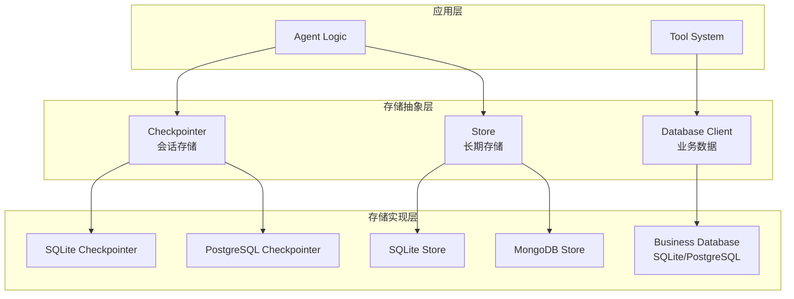

# 💾 数据库与存储详细设计文档

## 🎯 概述

本文档详细描述Agent Service Toolkit中的数据存储架构，包括SQL Agent的数据库集成、会话存储、长期记忆存储等核心组件的设计和实现。

## 🏗️ 存储架构概览

### 多层存储设计



## 🗄️ SQL Agent数据库集成

### 数据库客户端设计

```python
# src/core/database.py
class DatabaseClient:
    """安全的数据库客户端，支持SQLite"""
    
    def __init__(self, db_path: str = "sql_agent.db"):
        self.db_path = db_path
        self.connection_timeout = 30
        self._ensure_database_exists()
        self._create_sample_tables()
    
    @contextmanager
    def _get_connection(self):
        """获取数据库连接，自动处理错误"""
        conn = None
        try:
            conn = sqlite3.connect(
                self.db_path,
                timeout=self.connection_timeout,
                check_same_thread=False
            )
            conn.row_factory = sqlite3.Row  # 支持列名访问
            yield conn
        except sqlite3.Error as e:
            if conn:
                conn.rollback()
            raise DatabaseError(f"Database connection error: {e}")
        finally:
            if conn:
                conn.close()
    
    def get_schema_info(self) -> Dict[str, Any]:
        """获取数据库结构信息"""
        try:
            with self._get_connection() as conn:
                cursor = conn.cursor()
                
                # 获取所有表
                cursor.execute("""
                    SELECT name FROM sqlite_master 
                    WHERE type='table' AND name NOT LIKE 'sqlite_%'
                """)
                tables = [row[0] for row in cursor.fetchall()]
                
                schema_info = {
                    'database_type': 'SQLite',
                    'database_path': self.db_path,
                    'tables': {}
                }
                
                # 获取每个表的详细信息
                for table in tables:
                    cursor.execute(f'PRAGMA table_info({table})')
                    columns = cursor.fetchall()
                    
                    cursor.execute(f'SELECT COUNT(*) FROM {table}')
                    row_count = cursor.fetchone()[0]
                    
                    schema_info['tables'][table] = {
                        'columns': [
                            {
                                'name': col[1],
                                'type': col[2],
                                'not_null': bool(col[3]),
                                'default_value': col[4],
                                'primary_key': bool(col[5])
                            }
                            for col in columns
                        ],
                        'row_count': row_count
                    }
                
                return schema_info
                
        except Exception as e:
            logger.error(f'Failed to get schema info: {e}')
            return {
                'error': str(e),
                'database_type': 'SQLite',
                'database_path': self.db_path
            }
```

### SQL查询安全执行

```python
def execute_query(self, query: str, params: Optional[Tuple] = None) -> Dict[str, Any]:
    """安全执行SQL查询"""
    try:
        # SQL注入防护
        self._validate_sql_query(query)
        
        with self._get_connection() as conn:
            cursor = conn.cursor()
            
            # 使用参数化查询
            if params:
                cursor.execute(query, params)
            else:
                cursor.execute(query)
            
            # 处理不同类型的查询
            if query.upper().strip().startswith(('SELECT', 'WITH')):
                # SELECT查询
                rows = cursor.fetchall()
                columns = [desc[0] for desc in cursor.description] if cursor.description else []
                
                results = []
                for row in rows:
                    results.append(dict(zip(columns, row)))
                
                return {
                    'success': True,
                    'query': query,
                    'results': results,
                    'row_count': len(results),
                    'columns': columns,
                    'query_type': 'SELECT'
                }
            else:
                # INSERT, UPDATE, DELETE查询
                conn.commit()
                return {
                    'success': True,
                    'query': query,
                    'rows_affected': cursor.rowcount,
                    'query_type': 'MODIFY'
                }
                
    except Exception as e:
        return {
            'success': False,
            'error': str(e),
            'error_type': 'DATABASE_ERROR',
            'query': query
        }

def _validate_sql_query(self, query: str):
    """验证SQL查询安全性"""
    query_upper = query.upper().strip()
    
    # 禁止的操作
    forbidden_keywords = [
        'DROP', 'DELETE', 'TRUNCATE', 'ALTER', 'CREATE', 'INSERT', 'UPDATE',
        'PRAGMA', 'ATTACH', 'DETACH'
    ]
    
    for keyword in forbidden_keywords:
        if keyword in query_upper:
            raise SQLValidationError(f"Forbidden SQL keyword: {keyword}")
    
    # 只允许SELECT和WITH查询
    if not query_upper.startswith(('SELECT', 'WITH')):
        raise SQLValidationError("Only SELECT and WITH queries are allowed")
    
    # 检查查询长度
    if len(query) > 1000:
        raise SQLValidationError("Query too long")
```

### 示例数据初始化

```python
def _create_sample_tables(self):
    """创建示例表和数据"""
    sample_tables = [
        '''
        CREATE TABLE IF NOT EXISTS users (
            id INTEGER PRIMARY KEY AUTOINCREMENT,
            name TEXT NOT NULL,
            email TEXT UNIQUE NOT NULL,
            age INTEGER,
            department TEXT,
            salary DECIMAL(10,2),
            created_at TIMESTAMP DEFAULT CURRENT_TIMESTAMP
        )
        ''',
        '''
        CREATE TABLE IF NOT EXISTS orders (
            id INTEGER PRIMARY KEY AUTOINCREMENT,
            user_id INTEGER,
            product_name TEXT NOT NULL,
            amount DECIMAL(10,2) NOT NULL,
            order_date TIMESTAMP DEFAULT CURRENT_TIMESTAMP,
            status TEXT DEFAULT 'pending',
            FOREIGN KEY (user_id) REFERENCES users (id)
        )
        ''',
        '''
        CREATE TABLE IF NOT EXISTS products (
            id INTEGER PRIMARY KEY AUTOINCREMENT,
            name TEXT NOT NULL,
            price DECIMAL(10,2) NOT NULL,
            category TEXT,
            stock_quantity INTEGER DEFAULT 0,
            description TEXT
        )
        '''
    ]
    
    sample_data = [
        "INSERT OR IGNORE INTO users (name, email, age, department, salary) VALUES ('John Doe', 'john@example.com', 30, 'Engineering', 75000)",
        "INSERT OR IGNORE INTO users (name, email, age, department, salary) VALUES ('Jane Smith', 'jane@example.com', 25, 'Marketing', 65000)",
        "INSERT OR IGNORE INTO users (name, email, age, department, salary) VALUES ('Bob Johnson', 'bob@example.com', 35, 'Sales', 70000)",
        # ... 更多示例数据
    ]
    
    try:
        with self._get_connection() as conn:
            cursor = conn.cursor()
            
            # 创建表
            for table_sql in sample_tables:
                cursor.execute(table_sql)
            
            # 插入示例数据
            for data_sql in sample_data:
                cursor.execute(data_sql)
            
            conn.commit()
            logger.info("Sample tables and data created successfully")
            
    except Exception as e:
        logger.error(f"Failed to create sample tables: {e}")
```

## 💾 会话存储系统

### SQLite Checkpointer实现

```python
# src/memory/sqlite.py
class SqliteSaver(BaseCheckpointSaver):
    """SQLite会话检查点存储"""
    
    def __init__(self, conn: sqlite3.Connection):
        super().__init__()
        self.conn = conn
        self._setup_tables()
    
    def _setup_tables(self):
        """创建检查点存储表"""
        self.conn.execute("""
            CREATE TABLE IF NOT EXISTS checkpoints (
                thread_id TEXT,
                checkpoint_ns TEXT DEFAULT '',
                checkpoint_id TEXT,
                parent_checkpoint_id TEXT,
                type TEXT,
                checkpoint BLOB,
                metadata BLOB,
                created_at TIMESTAMP DEFAULT CURRENT_TIMESTAMP,
                PRIMARY KEY (thread_id, checkpoint_ns, checkpoint_id)
            )
        """)
        
        self.conn.execute("""
            CREATE INDEX IF NOT EXISTS idx_checkpoints_thread_id 
            ON checkpoints(thread_id)
        """)
        
        self.conn.execute("""
            CREATE INDEX IF NOT EXISTS idx_checkpoints_created_at 
            ON checkpoints(created_at)
        """)
        
        self.conn.commit()
    
    async def aput(
        self, 
        config: RunnableConfig, 
        checkpoint: Checkpoint, 
        metadata: dict,
        new_versions: dict
    ):
        """异步保存检查点"""
        thread_id = config["configurable"]["thread_id"]
        checkpoint_ns = config["configurable"].get("checkpoint_ns", "")
        
        # 序列化数据
        checkpoint_data = pickle.dumps(checkpoint)
        metadata_data = pickle.dumps(metadata)
        
        self.conn.execute("""
            INSERT OR REPLACE INTO checkpoints 
            (thread_id, checkpoint_ns, checkpoint_id, parent_checkpoint_id, 
             type, checkpoint, metadata)
            VALUES (?, ?, ?, ?, ?, ?, ?)
        """, (
            thread_id,
            checkpoint_ns,
            checkpoint.id,
            getattr(checkpoint, 'parent_id', None),
            checkpoint.__class__.__name__,
            checkpoint_data,
            metadata_data
        ))
        
        self.conn.commit()
    
    async def aget_tuple(self, config: RunnableConfig) -> Optional[CheckpointTuple]:
        """异步获取检查点"""
        thread_id = config["configurable"]["thread_id"]
        checkpoint_ns = config["configurable"].get("checkpoint_ns", "")
        
        cursor = self.conn.execute("""
            SELECT checkpoint, metadata, parent_checkpoint_id, checkpoint_id
            FROM checkpoints 
            WHERE thread_id = ? AND checkpoint_ns = ?
            ORDER BY created_at DESC 
            LIMIT 1
        """, (thread_id, checkpoint_ns))
        
        row = cursor.fetchone()
        if not row:
            return None
        
        # 反序列化数据
        checkpoint = pickle.loads(row[0])
        metadata = pickle.loads(row[1])
        
        return CheckpointTuple(
            config=config,
            checkpoint=checkpoint,
            metadata=metadata,
            parent_config=None  # 简化实现
        )
```

### PostgreSQL Checkpointer实现

```python
# src/memory/postgres.py
class PostgresSaver(BaseCheckpointSaver):
    """PostgreSQL会话检查点存储"""
    
    def __init__(self, connection_string: str):
        super().__init__()
        self.connection_string = connection_string
        self._setup_tables()
    
    async def _get_connection(self):
        """获取异步数据库连接"""
        import asyncpg
        return await asyncpg.connect(self.connection_string)
    
    def _setup_tables(self):
        """创建检查点存储表"""
        import psycopg2
        
        conn = psycopg2.connect(self.connection_string)
        cursor = conn.cursor()
        
        cursor.execute("""
            CREATE TABLE IF NOT EXISTS checkpoints (
                thread_id TEXT,
                checkpoint_ns TEXT DEFAULT '',
                checkpoint_id TEXT,
                parent_checkpoint_id TEXT,
                type TEXT,
                checkpoint BYTEA,
                metadata BYTEA,
                created_at TIMESTAMP DEFAULT CURRENT_TIMESTAMP,
                PRIMARY KEY (thread_id, checkpoint_ns, checkpoint_id)
            )
        """)
        
        cursor.execute("""
            CREATE INDEX IF NOT EXISTS idx_checkpoints_thread_id 
            ON checkpoints(thread_id)
        """)
        
        conn.commit()
        conn.close()
    
    async def aput(self, config: RunnableConfig, checkpoint: Checkpoint, metadata: dict, new_versions: dict):
        """异步保存检查点到PostgreSQL"""
        conn = await self._get_connection()
        
        try:
            thread_id = config["configurable"]["thread_id"]
            checkpoint_ns = config["configurable"].get("checkpoint_ns", "")
            
            checkpoint_data = pickle.dumps(checkpoint)
            metadata_data = pickle.dumps(metadata)
            
            await conn.execute("""
                INSERT INTO checkpoints 
                (thread_id, checkpoint_ns, checkpoint_id, parent_checkpoint_id, 
                 type, checkpoint, metadata)
                VALUES ($1, $2, $3, $4, $5, $6, $7)
                ON CONFLICT (thread_id, checkpoint_ns, checkpoint_id) 
                DO UPDATE SET 
                    checkpoint = EXCLUDED.checkpoint,
                    metadata = EXCLUDED.metadata,
                    created_at = CURRENT_TIMESTAMP
            """, 
                thread_id,
                checkpoint_ns,
                checkpoint.id,
                getattr(checkpoint, 'parent_id', None),
                checkpoint.__class__.__name__,
                checkpoint_data,
                metadata_data
            )
            
        finally:
            await conn.close()
```

## 🧠 长期记忆存储

### Store接口实现

```python
# src/memory/sqlite.py
class SqliteStore(BaseStore):
    """SQLite长期存储实现"""
    
    def __init__(self, conn: sqlite3.Connection):
        self.conn = conn
        self._setup_tables()
    
    def _setup_tables(self):
        """创建存储表"""
        self.conn.execute("""
            CREATE TABLE IF NOT EXISTS store (
                namespace TEXT,
                key TEXT,
                value BLOB,
                created_at TIMESTAMP DEFAULT CURRENT_TIMESTAMP,
                updated_at TIMESTAMP DEFAULT CURRENT_TIMESTAMP,
                PRIMARY KEY (namespace, key)
            )
        """)
        
        self.conn.execute("""
            CREATE INDEX IF NOT EXISTS idx_store_namespace 
            ON store(namespace)
        """)
        
        self.conn.commit()
    
    async def aput(self, namespace: tuple[str, ...], key: str, value: dict):
        """存储键值对"""
        ns_str = "/".join(namespace)
        value_data = pickle.dumps(value)
        
        self.conn.execute("""
            INSERT OR REPLACE INTO store (namespace, key, value, updated_at)
            VALUES (?, ?, ?, CURRENT_TIMESTAMP)
        """, (ns_str, key, value_data))
        
        self.conn.commit()
    
    async def aget(self, namespace: tuple[str, ...], key: str) -> Optional[dict]:
        """获取存储的值"""
        ns_str = "/".join(namespace)
        
        cursor = self.conn.execute("""
            SELECT value FROM store 
            WHERE namespace = ? AND key = ?
        """, (ns_str, key))
        
        row = cursor.fetchone()
        if row:
            return pickle.loads(row[0])
        return None
    
    async def asearch(self, namespace_prefix: tuple[str, ...]) -> list[tuple[tuple[str, ...], str, dict]]:
        """搜索存储的数据"""
        prefix = "/".join(namespace_prefix)
        
        cursor = self.conn.execute("""
            SELECT namespace, key, value FROM store 
            WHERE namespace LIKE ?
            ORDER BY updated_at DESC
        """, (f"{prefix}%",))
        
        results = []
        for row in cursor.fetchall():
            namespace = tuple(row[0].split("/"))
            key = row[1]
            value = pickle.loads(row[2])
            results.append((namespace, key, value))
        
        return results
```

### MongoDB Store实现

```python
# src/memory/mongodb.py
class MongoStore(BaseStore):
    """MongoDB长期存储实现"""
    
    def __init__(self, connection_string: str, database_name: str = "agent_store"):
        import motor.motor_asyncio
        self.client = motor.motor_asyncio.AsyncIOMotorClient(connection_string)
        self.db = self.client[database_name]
        self.collection = self.db.store
        
        # 创建索引
        asyncio.create_task(self._setup_indexes())
    
    async def _setup_indexes(self):
        """创建索引"""
        await self.collection.create_index([("namespace", 1), ("key", 1)], unique=True)
        await self.collection.create_index([("namespace", 1)])
        await self.collection.create_index([("updated_at", -1)])
    
    async def aput(self, namespace: tuple[str, ...], key: str, value: dict):
        """存储到MongoDB"""
        document = {
            "namespace": list(namespace),
            "key": key,
            "value": value,
            "updated_at": datetime.utcnow()
        }
        
        await self.collection.replace_one(
            {"namespace": list(namespace), "key": key},
            document,
            upsert=True
        )
    
    async def aget(self, namespace: tuple[str, ...], key: str) -> Optional[dict]:
        """从MongoDB获取"""
        document = await self.collection.find_one({
            "namespace": list(namespace),
            "key": key
        })
        
        return document["value"] if document else None
    
    async def asearch(self, namespace_prefix: tuple[str, ...]) -> list[tuple[tuple[str, ...], str, dict]]:
        """搜索MongoDB数据"""
        # 构建前缀匹配查询
        prefix_list = list(namespace_prefix)
        query = {"namespace": {"$regex": f"^{prefix_list}"}}
        
        cursor = self.collection.find(query).sort("updated_at", -1)
        
        results = []
        async for doc in cursor:
            namespace = tuple(doc["namespace"])
            key = doc["key"]
            value = doc["value"]
            results.append((namespace, key, value))
        
        return results
```

## 🔧 存储工厂模式

### 统一存储接口

```python
# src/memory/__init__.py
def get_checkpointer(storage_type: str = "sqlite") -> BaseCheckpointSaver:
    """获取检查点存储器"""
    if storage_type == "sqlite":
        conn = sqlite3.connect("checkpoints.db", check_same_thread=False)
        return SqliteSaver(conn)
    elif storage_type == "postgresql":
        connection_string = settings.POSTGRES_CONNECTION_STRING
        return PostgresSaver(connection_string)
    else:
        raise ValueError(f"Unsupported storage type: {storage_type}")

def get_store(storage_type: str = "sqlite") -> BaseStore:
    """获取长期存储器"""
    if storage_type == "sqlite":
        conn = sqlite3.connect("store.db", check_same_thread=False)
        return SqliteStore(conn)
    elif storage_type == "mongodb":
        connection_string = settings.MONGODB_CONNECTION_STRING
        return MongoStore(connection_string)
    else:
        raise ValueError(f"Unsupported storage type: {storage_type}")
```

### 存储配置管理

```python
# src/core/settings.py
class Settings(BaseSettings):
    """存储相关配置"""
    
    # 数据库配置
    DATABASE_TYPE: str = "sqlite"
    DATABASE_PATH: str = "sql_agent.db"
    
    # 检查点存储配置
    CHECKPOINT_STORAGE_TYPE: str = "sqlite"
    POSTGRES_CONNECTION_STRING: Optional[str] = None
    
    # 长期存储配置
    STORE_TYPE: str = "sqlite"
    MONGODB_CONNECTION_STRING: Optional[str] = None
    
    # 存储优化配置
    MAX_CHECKPOINT_HISTORY: int = 100
    CLEANUP_INTERVAL_HOURS: int = 24
    
    class Config:
        env_file = ".env"
```

---

*本文档详细描述了数据库与存储系统的设计和实现，为数据持久化提供技术指导。*
