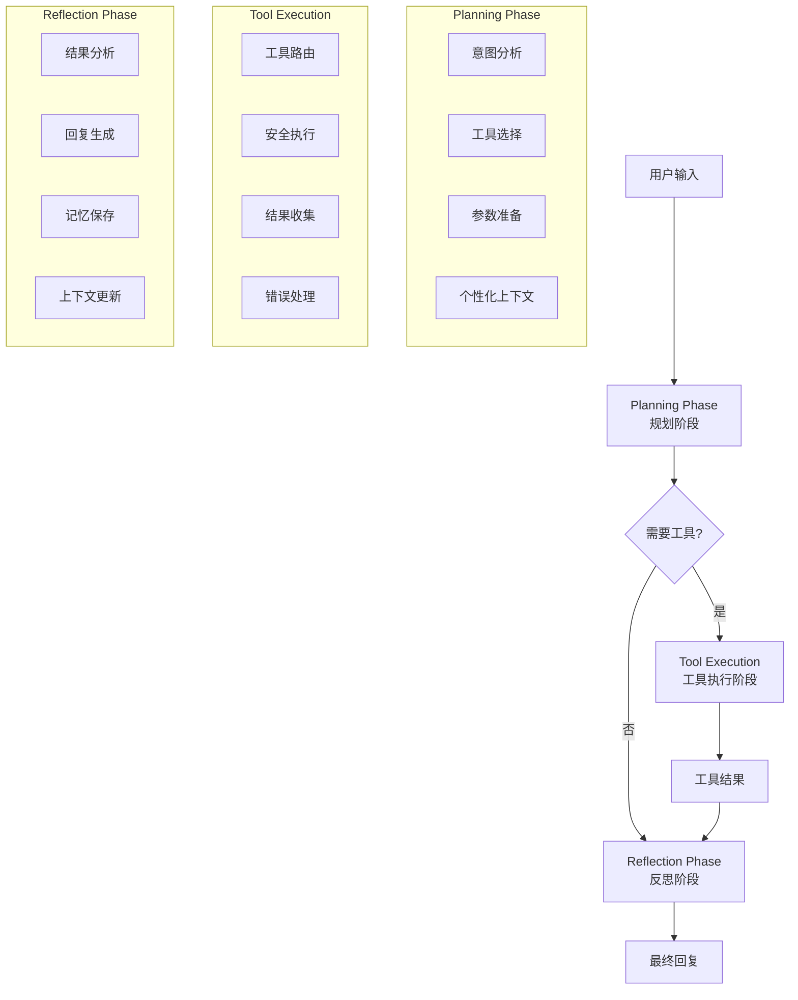

# 🗄️ SQL Agent详细设计文档

## 🎯 概述

SQL Agent是Agent Service Toolkit中的核心数据库助手，采用4阶段LangGraph工作流程，为用户提供智能的数据库查询、分析和洞察服务。

## 🏗️ 架构设计

### 四阶段工作流程



### 状态管理

```python
class SQLAgentState(MessagesState, total=False):
    """SQL Agent状态定义"""
    # 系统级字段
    safety: LlamaGuardOutput
    remaining_steps: RemainingSteps
    
    # SQL Agent特定字段
    planning_result: Optional[Dict[str, Any]]
    tool_execution_results: List[Dict[str, Any]]
    database_context: Optional[str]
    sql_query_history: List[str]
    analysis_insights: Optional[str]
    
    # 记忆系统字段
    user_preferences: Optional[Dict[str, Any]]
    query_patterns: List[Dict[str, Any]]
    personalized_context: Optional[str]
```

## 🔧 核心组件实现

### 1. Planning Phase (规划阶段)

```python
async def planning_phase(state: SQLAgentState, config: RunnableConfig, store: BaseStore) -> SQLAgentState:
    """规划阶段 - 分析用户意图并选择工具"""
    logger.info("🚀 Starting planning phase")
    
    # 加载用户记忆
    user_memory = await load_user_memory(config, store)
    
    # 获取数据库上下文
    schema_info = get_database_schema.invoke({})
    
    # 构建个性化上下文
    personalized_context = build_personalized_context(user_memory)
    
    # 创建规划提示
    planning_prompt = create_planning_prompt(schema_info, personalized_context, user_input)
    
    # 调用LLM进行规划
    model = get_model(config["configurable"].get("model"))
    model_with_tools = model.bind_tools(sql_tools)
    response = await model_with_tools.ainvoke(planning_messages, config)
    
    return {
        "messages": [response],
        "planning_result": extract_planning_result(response),
        "database_context": schema_info,
        "user_preferences": user_memory["preferences"],
        "personalized_context": personalized_context
    }
```

### 2. Tool Execution (工具执行阶段)

```python
# SQL Agent工具集
sql_tools = [
    get_database_schema,      # 获取数据库结构
    execute_sql_query,        # 执行SQL查询
    analyze_query_results,    # 分析查询结果
    analyze_database_schema,  # 分析数据库设计
    generate_sql_query,       # 生成SQL查询
]

@tool
def execute_sql_query(query: str) -> str:
    """安全执行SQL查询"""
    try:
        # SQL注入防护
        validate_sql_query(query)
        
        # 执行查询
        db_client = get_database_client()
        result = db_client.execute_query(query)
        
        # 返回JSON格式结果
        return json.dumps(result, ensure_ascii=False, indent=2)
    except Exception as e:
        return json.dumps({
            "success": False,
            "error": str(e),
            "query": query
        })
```

### 3. Reflection Phase (反思阶段)

```python
async def reflection_phase(state: SQLAgentState, config: RunnableConfig, store: BaseStore) -> SQLAgentState:
    """反思阶段 - 分析结果并生成最终回复"""
    logger.info("🤔 Starting reflection phase")
    
    # 分析工具执行结果
    tool_results = extract_tool_results(state["messages"])
    
    # 构建反思提示
    reflection_prompt = create_reflection_prompt(tool_results, state["planning_result"])
    
    # 生成最终回复
    model = get_model(config["configurable"].get("model"))
    response = await model.ainvoke(reflection_messages, config)
    
    # 保存查询到记忆系统
    await save_query_to_memory(state, config, store)
    
    return {"messages": [response]}
```

## 🧠 记忆系统集成

### 用户记忆管理

```python
async def load_user_memory(config: RunnableConfig, store: BaseStore) -> Dict[str, Any]:
    """从长期记忆加载用户偏好和查询历史"""
    user_id = config["configurable"].get("user_id", "anonymous")
    namespace = ("sql_agent", user_id)
    
    try:
        preferences = await store.aget(namespace, "preferences")
        query_history = await store.aget(namespace, "query_history")
        query_patterns = await store.aget(namespace, "query_patterns")
        
        return {
            "preferences": preferences.value if preferences else {},
            "query_history": query_history.value if query_history else [],
            "query_patterns": query_patterns.value if query_patterns else []
        }
    except Exception as e:
        logger.error(f"Error loading user memory: {e}")
        return {"preferences": {}, "query_history": [], "query_patterns": []}

def analyze_query_patterns(query_history: List[Dict[str, Any]]) -> List[Dict[str, Any]]:
    """分析用户查询模式"""
    patterns = []
    
    # 分析表使用频率
    table_usage = {}
    query_types = {}
    
    for query_record in query_history:
        query = query_record.get("query", "").lower()
        
        # 提取表名
        table_matches = re.findall(r'from\s+(\w+)', query)
        for table in table_matches:
            table_usage[table] = table_usage.get(table, 0) + 1
        
        # 分类查询类型
        if "select" in query:
            if "group by" in query or "count" in query:
                query_types["analytics"] = query_types.get("analytics", 0) + 1
            else:
                query_types["lookup"] = query_types.get("lookup", 0) + 1
    
    # 生成模式
    if table_usage:
        most_used_table = max(table_usage, key=table_usage.get)
        patterns.append({
            "type": "frequent_table",
            "table": most_used_table,
            "usage_count": table_usage[most_used_table],
            "description": f"Frequently queries {most_used_table} table"
        })
    
    return patterns
```

### 个性化上下文构建

```python
def build_personalized_context(user_memory: Dict[str, Any]) -> str:
    """构建个性化上下文"""
    context_parts = []
    
    # 最近查询历史
    if user_memory["query_history"]:
        recent_queries = user_memory["query_history"][-5:]
        context_parts.append(f"Recent queries: {[q.get('description', '') for q in recent_queries]}")
    
    # 用户偏好模式
    if user_memory["query_patterns"]:
        patterns = user_memory["query_patterns"]
        context_parts.append(f"User preferences: {[p.get('description', '') for p in patterns]}")
    
    return "\n".join(context_parts) if context_parts else ""
```

## 🛡️ 安全与验证

### SQL注入防护

```python
def validate_sql_query(query: str):
    """验证SQL查询安全性"""
    query_upper = query.upper().strip()
    
    # 禁止的操作
    forbidden_keywords = [
        'DROP', 'DELETE', 'TRUNCATE', 'ALTER', 'CREATE', 'INSERT', 'UPDATE',
        'PRAGMA', 'ATTACH', 'DETACH'
    ]
    
    for keyword in forbidden_keywords:
        if keyword in query_upper:
            raise SQLValidationError(f"Forbidden SQL keyword: {keyword}")
    
    # 只允许SELECT和WITH查询
    if not query_upper.startswith(('SELECT', 'WITH')):
        raise SQLValidationError("Only SELECT and WITH queries are allowed")
    
    # 检查查询长度
    if len(query) > 1000:
        raise SQLValidationError("Query too long")
```

### 错误处理

```python
async def handle_sql_error(error: Exception, context: str) -> Dict[str, Any]:
    """处理SQL执行错误"""
    if isinstance(error, SQLValidationError):
        return {
            "success": False,
            "error": f"Security validation failed: {error}",
            "error_type": "VALIDATION_ERROR"
        }
    elif isinstance(error, sqlite3.Error):
        return {
            "success": False,
            "error": f"Database error: {error}",
            "error_type": "DATABASE_ERROR"
        }
    else:
        logger.exception(f"Unexpected error in {context}")
        return {
            "success": False,
            "error": "An unexpected error occurred",
            "error_type": "SYSTEM_ERROR"
        }
```

## 📊 性能优化

### 查询优化

```python
def optimize_query_execution(query: str) -> str:
    """优化SQL查询执行"""
    # 添加LIMIT子句防止大结果集
    if "LIMIT" not in query.upper() and "SELECT" in query.upper():
        query += " LIMIT 1000"
    
    return query

def cache_schema_info():
    """缓存数据库结构信息"""
    # 实现schema信息缓存，减少重复查询
    pass
```

### 监控与日志

```python
async def log_sql_execution(query: str, execution_time: float, success: bool):
    """记录SQL执行日志"""
    logger.info(
        "sql_execution",
        query_hash=hashlib.md5(query.encode()).hexdigest()[:8],
        execution_time=execution_time,
        success=success,
        timestamp=datetime.utcnow().isoformat()
    )
```

## 🧪 测试策略

### 单元测试

```python
async def test_planning_phase():
    """测试规划阶段"""
    state = SQLAgentState(messages=[HumanMessage(content="Show me all users")])
    config = {"configurable": {"user_id": "test", "model": "test"}}
    store = InMemoryStore()
    
    result = await planning_phase(state, config, store)
    
    assert "messages" in result
    assert "planning_result" in result
    assert "database_context" in result

async def test_memory_integration():
    """测试记忆系统集成"""
    # 测试用户记忆加载和保存
    # 测试查询模式分析
    # 测试个性化上下文构建
    pass
```

### 集成测试

```python
async def test_end_to_end_workflow():
    """端到端工作流程测试"""
    # 测试完整的4阶段工作流程
    # 验证记忆系统集成
    # 检查安全性和错误处理
    pass
```

---

*本文档详细描述了SQL Agent的设计和实现，为开发和维护提供技术参考。*
