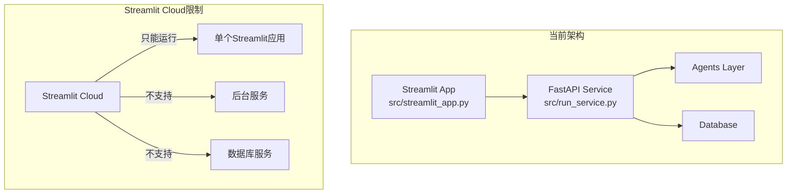

# 🚀 Streamlit Cloud 部署指南

## ⚠️ 重要说明

**当前项目架构限制**：Agent Service Toolkit采用分离式架构（Streamlit前端 + FastAPI后端），**无法直接部署到Streamlit Cloud**。

### 架构分析



## 🔍 当前项目依赖分析

### 1. 服务依赖关系

**Streamlit应用依赖**：
```python
# src/streamlit_app.py 第169-182行
if "agent_client" not in st.session_state:
    load_dotenv()
    agent_url = os.getenv("AGENT_URL")
    if not agent_url:
        host = os.getenv("HOST", "0.0.0.0")
        port = os.getenv("PORT", 8080)
        agent_url = f"http://{host}:{port}"
    try:
        with st.spinner("Connecting to agent service..."):
            st.session_state.agent_client = AgentClient(base_url=agent_url)
    except AgentClientError as e:
        st.error(f"Error connecting to agent service at {agent_url}: {e}")
        st.stop()
```

**关键发现**：
- Streamlit应用通过`AgentClient`连接到FastAPI服务
- 需要`AGENT_URL`环境变量指向后端服务
- 无法独立运行，必须有后端服务支持

### 2. 环境变量需求

**必需的环境变量**：
```bash
# LLM API密钥 (至少一个)
DEEPSEEK_API_KEY=your_deepseek_api_key
DEEPSEEK_BASE_URL=https://api.deepseek.com

# 后端服务地址 (关键)
AGENT_URL=http://your-backend-service-url

# 可选的API密钥
OPENAI_API_KEY=your_openai_api_key
OPENWEATHERMAP_API_KEY=your_weather_api_key
LANGSMITH_API_KEY=your_langsmith_api_key
```

## 🛠️ 解决方案选项

### 选项1：混合部署架构 (推荐)

#### 1.1 后端服务部署
**推荐平台**：
- **Railway**: 简单易用，支持FastAPI
- **Render**: 免费层支持，自动部署
- **Heroku**: 成熟平台，但需付费
- **Azure Container Apps**: 企业级选择

#### 1.2 Railway部署步骤

**步骤1：准备后端部署**
```bash
# 1. 创建 railway.toml
[build]
builder = "nixpacks"

[deploy]
startCommand = "python src/run_service.py"

[env]
PORT = "8080"
```

**步骤2：环境变量配置**
```bash
# Railway环境变量设置
DEEPSEEK_API_KEY=your_deepseek_api_key
DEEPSEEK_BASE_URL=https://api.deepseek.com
HOST=0.0.0.0
PORT=8080
DATABASE_TYPE=sqlite
SQLITE_DB_PATH=checkpoints.db
```

**步骤3：部署到Railway**
```bash
# 安装Railway CLI
npm install -g @railway/cli

# 登录并部署
railway login
railway init
railway up
```

#### 1.3 Streamlit Cloud部署

**步骤1：获取后端URL**
```bash
# Railway部署完成后获取URL
BACKEND_URL=https://your-app-name.railway.app
```

**步骤2：配置Streamlit Secrets**
```toml
# .streamlit/secrets.toml
DEEPSEEK_API_KEY = "your_deepseek_api_key"
DEEPSEEK_BASE_URL = "https://api.deepseek.com"
AGENT_URL = "https://your-app-name.railway.app"
OPENAI_API_KEY = "your_openai_api_key"
OPENWEATHERMAP_API_KEY = "your_weather_api_key"
```

**步骤3：部署到Streamlit Cloud**
1. 访问 [share.streamlit.io](https://share.streamlit.io)
2. 连接GitHub仓库
3. 设置应用路径：`src/streamlit_app.py`
4. 配置环境变量（从secrets.toml复制）

### 选项2：单体应用重构 (需要开发)

#### 2.1 架构重构方案
```python
# 新的单体应用结构
src/
├── streamlit_app_standalone.py    # 独立Streamlit应用
├── agents/                        # Agent实现（内嵌）
├── core/                         # 核心服务（内嵌）
└── tools/                        # 工具系统（内嵌）
```

#### 2.2 重构要点
```python
# streamlit_app_standalone.py
import streamlit as st
from agents.sql_agent import sql_agent
from core.models import get_model

# 直接在Streamlit中运行Agent
@st.cache_resource
def get_agent_instance():
    return sql_agent

async def run_agent_directly(user_input: str, model: str):
    """直接运行Agent，无需API调用"""
    agent = get_agent_instance()
    config = {"configurable": {"model": model, "user_id": "streamlit_user"}}
    result = await agent.ainvoke({"messages": [("user", user_input)]}, config)
    return result["messages"][-1].content
```

## 📋 当前可行的部署方案

### 方案A：Railway + Streamlit Cloud (推荐)

#### 优势：
- ✅ 保持现有架构不变
- ✅ 快速部署，无需重构
- ✅ 后端服务独立扩展
- ✅ 支持所有现有功能

#### 部署步骤：

**1. 后端部署到Railway**
```bash
# 克隆项目
git clone https://github.com/franksunye/agent-service-toolkit.git
cd agent-service-toolkit

# 安装Railway CLI
npm install -g @railway/cli

# 登录Railway
railway login

# 初始化项目
railway init

# 设置环境变量
railway variables set DEEPSEEK_API_KEY=your_key
railway variables set DEEPSEEK_BASE_URL=https://api.deepseek.com
railway variables set HOST=0.0.0.0
railway variables set PORT=8080

# 部署
railway up
```

**2. 前端部署到Streamlit Cloud**
```bash
# 1. Fork项目到你的GitHub
# 2. 访问 https://share.streamlit.io
# 3. 选择你的仓库
# 4. 设置应用路径: src/streamlit_app.py
# 5. 配置环境变量:
#    AGENT_URL = https://your-railway-app.railway.app
#    DEEPSEEK_API_KEY = your_key
```

### 方案B：完全云端部署

#### 使用Render (免费层)

**后端部署**：
```yaml
# render.yaml
services:
  - type: web
    name: agent-service
    env: python
    buildCommand: pip install -r requirements.txt
    startCommand: python src/run_service.py
    envVars:
      - key: DEEPSEEK_API_KEY
        sync: false
      - key: HOST
        value: 0.0.0.0
      - key: PORT
        value: 10000
```

**前端配置**：
```toml
# .streamlit/secrets.toml
AGENT_URL = "https://your-app-name.onrender.com"
DEEPSEEK_API_KEY = "your_key"
```

## 🔧 环境变量配置详解

### Streamlit Cloud环境变量设置

**方法1：通过Web界面**
1. 登录Streamlit Cloud
2. 选择你的应用
3. 点击"Settings" → "Secrets"
4. 添加以下配置：

```toml
DEEPSEEK_API_KEY = "your_deepseek_api_key"
DEEPSEEK_BASE_URL = "https://api.deepseek.com"
AGENT_URL = "https://your-backend-service-url"

# 可选配置
OPENAI_API_KEY = "your_openai_api_key"
OPENWEATHERMAP_API_KEY = "your_weather_api_key"
LANGSMITH_API_KEY = "your_langsmith_api_key"
LANGSMITH_PROJECT = "your_project_name"
```

**方法2：通过secrets.toml文件**
```bash
# 创建 .streamlit/secrets.toml
mkdir -p .streamlit
cat > .streamlit/secrets.toml << EOF
DEEPSEEK_API_KEY = "your_deepseek_api_key"
AGENT_URL = "https://your-backend-service-url"
EOF
```

### 后端服务环境变量

**Railway配置**：
```bash
railway variables set DEEPSEEK_API_KEY=your_key
railway variables set DEEPSEEK_BASE_URL=https://api.deepseek.com
railway variables set HOST=0.0.0.0
railway variables set PORT=8080
railway variables set DATABASE_TYPE=sqlite
railway variables set SQLITE_DB_PATH=checkpoints.db
```

**Render配置**：
```bash
# 在Render Dashboard中设置
DEEPSEEK_API_KEY=your_key
DEEPSEEK_BASE_URL=https://api.deepseek.com
HOST=0.0.0.0
PORT=10000
```

## ⚡ 快速部署检查清单

### 部署前检查
- [ ] 获取DeepSeek API密钥
- [ ] 选择后端部署平台 (Railway/Render)
- [ ] 准备GitHub仓库访问权限
- [ ] 确认项目依赖完整性

### 后端部署检查
- [ ] 后端服务成功启动
- [ ] API端点可访问 (`/info`, `/health`)
- [ ] 环境变量正确配置
- [ ] 数据库连接正常

### 前端部署检查
- [ ] Streamlit应用启动成功
- [ ] 能连接到后端服务
- [ ] Agent选择功能正常
- [ ] 聊天功能可用

## 🚨 常见问题解决

### 问题1：连接后端服务失败
```python
# 错误信息
Error connecting to agent service at http://localhost:8080: Connection refused
```

**解决方案**：
1. 检查`AGENT_URL`环境变量是否正确
2. 确认后端服务已部署并运行
3. 验证后端服务的健康检查端点

### 问题2：API密钥配置错误
```python
# 错误信息
Error: DeepSeek API key not found
```

**解决方案**：
1. 在Streamlit Cloud中配置`DEEPSEEK_API_KEY`
2. 在后端服务中配置相同的API密钥
3. 检查密钥格式是否正确

### 问题3：CORS跨域问题
```python
# 错误信息
Access to fetch at 'https://backend.com' from origin 'https://app.streamlit.io' has been blocked by CORS policy
```

**解决方案**：
```python
# 在FastAPI服务中添加CORS配置
from fastapi.middleware.cors import CORSMiddleware

app.add_middleware(
    CORSMiddleware,
    allow_origins=["https://*.streamlit.app", "https://share.streamlit.io"],
    allow_credentials=True,
    allow_methods=["*"],
    allow_headers=["*"],
)
```

## 📊 部署成本估算

### 免费层部署
- **Streamlit Cloud**: 免费
- **Railway**: 免费层 500小时/月
- **Render**: 免费层 750小时/月
- **总成本**: $0/月

### 付费层部署
- **Streamlit Cloud**: 免费
- **Railway**: $5-20/月
- **Render**: $7-25/月
- **总成本**: $5-25/月

## 🎯 推荐部署方案

**对于个人项目**：Railway (后端) + Streamlit Cloud (前端)
**对于企业项目**：Azure Container Apps + Streamlit Cloud
**对于开源项目**：Render (后端) + Streamlit Cloud (前端)

## 🛠️ 详细实施指南

### 步骤1：准备后端部署文件

#### 创建Railway配置文件
```toml
# railway.toml
[build]
builder = "nixpacks"

[deploy]
startCommand = "python src/run_service.py"
healthcheckPath = "/health"
healthcheckTimeout = 300
restartPolicyType = "on_failure"

[env]
PORT = { default = "8080" }
HOST = { default = "0.0.0.0" }
DATABASE_TYPE = { default = "sqlite" }
SQLITE_DB_PATH = { default = "checkpoints.db" }
```

#### 创建requirements.txt (如果不存在)
```txt
# 确保包含所有必需依赖
fastapi>=0.115.5
uvicorn>=0.32.1
langgraph>=0.3.5
langchain-core>=0.3.33
pydantic>=2.10.1
python-dotenv>=1.0.1
httpx>=0.27.2
```

#### 添加健康检查端点
```python
# 在 src/service/service.py 中确保有健康检查
@app.get("/health")
async def health_check():
    """健康检查端点，用于部署平台监控"""
    return {
        "status": "healthy",
        "timestamp": datetime.now().isoformat(),
        "service": "agent-service-toolkit"
    }
```

### 步骤2：Railway部署实战

#### 2.1 安装和配置Railway CLI
```bash
# 安装Railway CLI
npm install -g @railway/cli

# 或使用curl安装
curl -fsSL https://railway.app/install.sh | sh

# 登录Railway
railway login
```

#### 2.2 初始化和部署
```bash
# 在项目根目录
cd agent-service-toolkit

# 初始化Railway项目
railway init

# 设置环境变量
railway variables set DEEPSEEK_API_KEY="your_deepseek_api_key"
railway variables set DEEPSEEK_BASE_URL="https://api.deepseek.com"
railway variables set HOST="0.0.0.0"
railway variables set PORT="8080"
railway variables set DATABASE_TYPE="sqlite"
railway variables set SQLITE_DB_PATH="checkpoints.db"

# 可选：设置其他API密钥
railway variables set OPENAI_API_KEY="your_openai_api_key"
railway variables set OPENWEATHERMAP_API_KEY="your_weather_api_key"

# 部署
railway up

# 获取部署URL
railway status
```

#### 2.3 验证后端部署
```bash
# 检查服务状态
curl https://your-app-name.railway.app/health

# 检查API信息
curl https://your-app-name.railway.app/info

# 预期响应
{
  "status": "healthy",
  "timestamp": "2024-01-01T12:00:00",
  "service": "agent-service-toolkit"
}
```

### 步骤3：Streamlit Cloud部署实战

#### 3.1 准备Streamlit配置
```bash
# 创建Streamlit配置目录
mkdir -p .streamlit

# 创建配置文件
cat > .streamlit/config.toml << EOF
[server]
headless = true
port = 8501

[browser]
gatherUsageStats = false
EOF
```

#### 3.2 创建secrets配置
```toml
# .streamlit/secrets.toml
# 注意：这个文件不要提交到Git

# 后端服务地址 (替换为你的Railway URL)
AGENT_URL = "https://your-app-name.railway.app"

# LLM API密钥
DEEPSEEK_API_KEY = "your_deepseek_api_key"
DEEPSEEK_BASE_URL = "https://api.deepseek.com"

# 可选API密钥
OPENAI_API_KEY = "your_openai_api_key"
OPENWEATHERMAP_API_KEY = "your_weather_api_key"

# LangSmith追踪 (可选)
LANGSMITH_API_KEY = "your_langsmith_api_key"
LANGSMITH_PROJECT = "agent-service-toolkit"
LANGCHAIN_TRACING_V2 = true
```

#### 3.3 部署到Streamlit Cloud
1. **访问Streamlit Cloud**：https://share.streamlit.io
2. **连接GitHub**：授权访问你的仓库
3. **创建新应用**：
   - Repository: `your-username/agent-service-toolkit`
   - Branch: `main` 或 `feature/sql-agent-development`
   - Main file path: `src/streamlit_app.py`
4. **配置环境变量**：
   - 点击 "Advanced settings"
   - 复制 `.streamlit/secrets.toml` 的内容到 "Secrets" 区域

### 步骤4：验证完整部署

#### 4.1 功能测试清单
```bash
# 1. 访问Streamlit应用
https://your-app-name.streamlit.app

# 2. 检查连接状态
# 应该看到 "Connecting to agent service..." 然后成功连接

# 3. 测试Agent功能
# 在聊天界面输入: "What tables are in the database?"

# 4. 检查模型选择
# 在侧边栏Settings中应该能看到可用模型

# 5. 测试流式响应
# 确保 "Stream results" 开关正常工作
```

#### 4.2 监控和日志
```bash
# Railway日志查看
railway logs

# Streamlit Cloud日志
# 在Streamlit Cloud dashboard中查看应用日志

# 健康检查
curl https://your-railway-app.railway.app/health
```

### 步骤5：自定义域名配置 (可选)

#### 5.1 Railway自定义域名
```bash
# 在Railway Dashboard中
# 1. 进入你的项目
# 2. 点击 "Settings" → "Domains"
# 3. 添加自定义域名
# 4. 配置DNS CNAME记录指向Railway
```

#### 5.2 更新Streamlit配置
```toml
# 更新 .streamlit/secrets.toml
AGENT_URL = "https://your-custom-domain.com"
```

## 🔧 故障排除指南

### 常见错误及解决方案

#### 错误1：Railway部署失败
```bash
# 错误信息
Error: Build failed with exit code 1

# 解决步骤
1. 检查 requirements.txt 是否完整
2. 确认 Python 版本兼容性
3. 查看构建日志: railway logs --deployment
```

#### 错误2：Streamlit无法连接后端
```python
# 错误信息
Error connecting to agent service at None: Invalid URL

# 解决步骤
1. 检查 AGENT_URL 环境变量是否设置
2. 确认Railway服务正在运行
3. 验证URL格式正确 (包含 https://)
```

#### 错误3：API密钥错误
```python
# 错误信息
Error: DeepSeek API key not found

# 解决步骤
1. 在Railway中设置 DEEPSEEK_API_KEY
2. 在Streamlit Cloud中设置相同密钥
3. 重启两个服务
```

### 调试技巧

#### 1. 本地测试后端连接
```python
# test_connection.py
import httpx
import os

backend_url = "https://your-app-name.railway.app"

async def test_connection():
    async with httpx.AsyncClient() as client:
        try:
            response = await client.get(f"{backend_url}/health")
            print(f"Status: {response.status_code}")
            print(f"Response: {response.json()}")
        except Exception as e:
            print(f"Error: {e}")

# 运行测试
import asyncio
asyncio.run(test_connection())
```

#### 2. 检查环境变量
```python
# 在Streamlit应用中添加调试信息
import streamlit as st
import os

# 调试模式 (仅在开发时使用)
if st.sidebar.checkbox("Debug Mode"):
    st.sidebar.write("Environment Variables:")
    st.sidebar.write(f"AGENT_URL: {os.getenv('AGENT_URL', 'Not Set')}")
    st.sidebar.write(f"DEEPSEEK_API_KEY: {'Set' if os.getenv('DEEPSEEK_API_KEY') else 'Not Set'}")
```

## 📈 性能优化建议

### 1. Railway优化
```toml
# railway.toml 优化配置
[deploy]
startCommand = "uvicorn service:app --host 0.0.0.0 --port $PORT --workers 2"
healthcheckPath = "/health"
healthcheckTimeout = 300
```

### 2. Streamlit优化
```python
# 在streamlit_app.py中添加缓存
@st.cache_resource
def get_agent_client():
    """缓存Agent客户端连接"""
    agent_url = os.getenv("AGENT_URL")
    return AgentClient(base_url=agent_url)
```

### 3. 连接池优化
```python
# 在AgentClient中使用连接池
import httpx

class OptimizedAgentClient:
    def __init__(self, base_url: str):
        self.base_url = base_url
        self.client = httpx.AsyncClient(
            timeout=30.0,
            limits=httpx.Limits(max_connections=10, max_keepalive_connections=5)
        )
```

---

*本文档提供了完整的Streamlit Cloud部署解决方案，包括详细的实施步骤和故障排除指南。*
