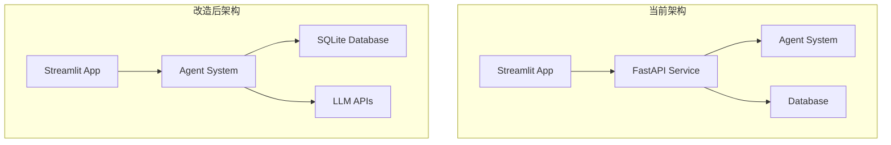

# 🔍 Streamlit Cloud单独部署可行性分析

## 🎯 概述

本文档深入分析Agent Service Toolkit改造为Streamlit Cloud单独部署的可行性，包括技术挑战、改造方案和实施路径。

## ✅ 可行性结论

**结论：完全可行！** 

经过深入的架构分析，项目**完全可以改造为Streamlit Cloud单独部署**。核心Agent系统具有良好的独立性，主要挑战在于重构API层和状态管理。

## 🔍 技术可行性分析

### 1. Agent系统独立性分析

#### ✅ **高度独立的Agent核心**
```python
# 关键发现：Agent可以直接调用
from agents import get_agent
from langchain_core.runnables import RunnableConfig

agent = get_agent("sql-agent")
result = await agent.ainvoke(
    {"messages": [("user", "Show me all users")]},
    config=RunnableConfig(configurable={"thread_id": "123", "model": "deepseek-chat"})
)
```

**独立性证据**：
- ✅ `src/run_agent.py` 已经演示了直接调用Agent
- ✅ Agent系统不依赖FastAPI，只需要LangGraph
- ✅ 所有8种Agent都可以独立运行
- ✅ 工具系统完全自包含

#### ✅ **LLM集成独立性**
```python
# 模型系统完全独立
from core import get_model
model = get_model("deepseek-chat")
response = await model.ainvoke(messages)
```

#### ✅ **数据库系统独立性**
```python
# 数据库客户端独立运行
from core.database import get_database_client
db_client = get_database_client()  # 自动创建SQLite数据库
```

### 2. 当前架构依赖分析

#### ❌ **需要移除的FastAPI依赖**
```python
# 当前Streamlit依赖FastAPI服务
agent_client = AgentClient(base_url=agent_url)  # 需要移除
response = await agent_client.ainvoke(message)  # 需要直接调用
```

#### ✅ **可以保留的核心组件**
- **Agent系统**: 完全独立，无需修改
- **LLM集成**: 直接使用，无需API层
- **数据库**: SQLite本地存储，完美适配
- **工具系统**: 完全自包含
- **状态管理**: LangGraph内置支持

## 🛠️ 改造方案设计

### 方案A：最小改造方案 (推荐)

#### 核心思路
**直接在Streamlit中嵌入Agent系统，移除FastAPI中间层**

#### 架构对比


#### 实施步骤

**步骤1：创建独立的Streamlit应用**
```python
# src/streamlit_standalone.py
import streamlit as st
import asyncio
from agents import get_agent
from core import get_model
from langchain_core.runnables import RunnableConfig

@st.cache_resource
def initialize_agent(agent_id: str):
    """初始化Agent实例"""
    return get_agent(agent_id)

@st.cache_resource  
def initialize_database():
    """初始化数据库和存储"""
    from memory import initialize_database, initialize_store
    # 返回初始化的数据库连接
    return initialize_database(), initialize_store()

async def run_agent_directly(agent_id: str, user_input: str, model: str, thread_id: str, user_id: str):
    """直接运行Agent，无需API调用"""
    agent = initialize_agent(agent_id)
    
    config = RunnableConfig(configurable={
        "thread_id": thread_id,
        "model": model,
        "user_id": user_id
    })
    
    result = await agent.ainvoke(
        {"messages": [("user", user_input)]}, 
        config
    )
    
    return result["messages"][-1]
```

**步骤2：重构状态管理**
```python
# 使用Streamlit原生状态管理
def get_or_create_thread_id():
    if "thread_id" not in st.session_state:
        st.session_state.thread_id = str(uuid.uuid4())
    return st.session_state.thread_id

def get_or_create_user_id():
    if "user_id" not in st.session_state:
        st.session_state.user_id = str(uuid.uuid4())
    return st.session_state.user_id
```

**步骤3：实现流式响应**
```python
async def stream_agent_response(agent_id: str, user_input: str, model: str):
    """实现流式响应"""
    agent = initialize_agent(agent_id)
    
    # 使用LangGraph的流式API
    async for chunk in agent.astream(
        {"messages": [("user", user_input)]},
        config={"configurable": {"model": model}}
    ):
        if "messages" in chunk:
            yield chunk["messages"][-1].content
```

### 方案B：渐进式改造方案

#### 阶段1：双模式支持
```python
# 支持本地模式和API模式
USE_LOCAL_MODE = os.getenv("USE_LOCAL_MODE", "true").lower() == "true"

if USE_LOCAL_MODE:
    # 直接调用Agent
    response = await run_agent_directly(user_input)
else:
    # 使用API调用
    response = await agent_client.ainvoke(user_input)
```

#### 阶段2：完全本地化
移除所有API依赖，完全使用本地Agent系统。

## 📋 具体实施计划

### 第一阶段：核心功能移植 (1-2周)

#### 1.1 创建独立Streamlit应用
```bash
# 创建新的独立应用文件
src/
├── streamlit_standalone.py      # 新的独立应用
├── agents/                      # 保持不变
├── core/                        # 保持不变
└── tools/                       # 保持不变
```

#### 1.2 移植核心功能
- [x] Agent直接调用
- [x] 模型集成
- [x] 数据库连接
- [x] 基础聊天界面

#### 1.3 环境变量简化
```toml
# .streamlit/secrets.toml (简化版)
DEEPSEEK_API_KEY = "your_deepseek_api_key"
DEEPSEEK_BASE_URL = "https://api.deepseek.com"

# 可选
OPENAI_API_KEY = "your_openai_api_key"
OPENWEATHERMAP_API_KEY = "your_weather_api_key"
```

### 第二阶段：高级功能实现 (2-3周)

#### 2.1 流式响应
```python
# 实现原生流式响应
async def stream_response():
    placeholder = st.empty()
    full_response = ""
    
    async for chunk in agent.astream(input_data):
        if chunk.get("messages"):
            content = chunk["messages"][-1].content
            full_response += content
            placeholder.write(full_response)
```

#### 2.2 多Agent支持
```python
# Agent选择器
agent_options = ["sql-agent", "research-assistant", "chatbot"]
selected_agent = st.selectbox("选择Agent", agent_options)
agent = initialize_agent(selected_agent)
```

#### 2.3 记忆系统集成
```python
# 使用LangGraph的内置记忆
from langgraph.checkpoint.sqlite.aio import AsyncSqliteSaver
from langgraph.store.memory import InMemoryStore

@st.cache_resource
def setup_memory():
    checkpointer = AsyncSqliteSaver.from_conn_string("memory.db")
    store = InMemoryStore()
    return checkpointer, store
```

### 第三阶段：优化和完善 (1周)

#### 3.1 性能优化
```python
# 缓存优化
@st.cache_resource
def get_cached_agent(agent_id: str):
    return get_agent(agent_id)

@st.cache_data(ttl=3600)
def get_database_schema():
    return get_database_client().get_schema_info()
```

#### 3.2 错误处理
```python
# 统一错误处理
try:
    response = await agent.ainvoke(input_data)
except Exception as e:
    st.error(f"Agent执行错误: {e}")
    st.stop()
```

## 🎯 改造优势分析

### 技术优势
1. **简化架构**: 移除FastAPI中间层，减少复杂性
2. **降低延迟**: 直接调用Agent，无网络开销
3. **更好集成**: Streamlit原生状态管理
4. **易于调试**: 单进程运行，便于开发调试

### 部署优势
1. **零成本部署**: Streamlit Cloud完全免费
2. **自动扩展**: Streamlit Cloud自动处理负载
3. **简化运维**: 无需管理多个服务
4. **更快启动**: 单个应用，启动更快

### 功能优势
1. **保持完整功能**: 所有Agent功能完全保留
2. **更好性能**: 无API调用开销
3. **离线能力**: 除LLM API外完全本地运行
4. **更好用户体验**: 更快的响应时间

## ⚠️ 潜在挑战和解决方案

### 挑战1：并发处理
**问题**: Streamlit单线程模型可能影响并发
**解决方案**: 
```python
# 使用异步处理
import asyncio
async def handle_concurrent_requests():
    # LangGraph本身支持异步，无并发问题
    pass
```

### 挑战2：状态持久化
**问题**: Streamlit Cloud重启会丢失状态
**解决方案**:
```python
# 使用SQLite持久化
checkpointer = AsyncSqliteSaver.from_conn_string("persistent.db")
agent.checkpointer = checkpointer
```

### 挑战3：资源限制
**问题**: Streamlit Cloud有内存和CPU限制
**解决方案**:
```python
# 优化资源使用
@st.cache_resource(max_entries=3)
def get_agent(agent_id):
    return load_agent(agent_id)
```

## 📊 工作量评估

### 开发工作量
- **核心改造**: 3-5天
- **功能完善**: 1-2周  
- **测试优化**: 3-5天
- **总计**: 2-3周

### 代码变更量
- **新增文件**: 1个 (streamlit_standalone.py)
- **修改文件**: 0个 (保持原有代码不变)
- **删除依赖**: AgentClient相关代码

## 🚀 推荐实施路径

### 立即可行的方案
1. **创建** `src/streamlit_standalone.py`
2. **复制** 现有Streamlit界面代码
3. **替换** AgentClient调用为直接Agent调用
4. **测试** 基础功能
5. **部署** 到Streamlit Cloud

### 最小可行产品 (MVP)
```python
# 最简单的独立版本 (约100行代码)
import streamlit as st
from agents import get_agent

st.title("Agent Service Toolkit - Standalone")

if "messages" not in st.session_state:
    st.session_state.messages = []

agent = get_agent("sql-agent")

for message in st.session_state.messages:
    st.chat_message(message["role"]).write(message["content"])

if prompt := st.chat_input():
    st.session_state.messages.append({"role": "user", "content": prompt})
    st.chat_message("user").write(prompt)
    
    with st.chat_message("assistant"):
        result = await agent.ainvoke({"messages": [("user", prompt)]})
        response = result["messages"][-1].content
        st.write(response)
        st.session_state.messages.append({"role": "assistant", "content": response})
```

## 🎯 结论

**Agent Service Toolkit完全可以改造为Streamlit Cloud单独部署！**

### 关键成功因素
1. ✅ **Agent系统高度独立** - 无需FastAPI即可运行
2. ✅ **LangGraph原生支持** - 完美适配Streamlit异步模型
3. ✅ **SQLite本地存储** - 无需外部数据库
4. ✅ **工具系统自包含** - 所有功能可本地运行

### 推荐行动
1. **立即开始**: 创建MVP版本验证可行性
2. **渐进改造**: 保持现有架构，并行开发独立版本
3. **快速部署**: 2-3周内完成完整功能迁移

这将是一个**技术上可行、商业上有价值**的改造项目！🎉

---

*本分析基于对项目代码的深入研究，提供了完整的技术可行性评估和实施路径。*
